# 历史图谱（微信小程序 + 后端服务）系统设计文档 v1

> **后端技术栈**：Spring Boot（建议 Java 17 / Spring Boot 3.x） + MySQL 8.0 + Redis + 对象存储（COS/OSS）  
> **客户端**：微信小程序（暗色主题，v3 原型 11 屏）  
> **设计原则**：DDD（边界上下文、聚合根、领域服务、应用服务、仓储）+ 接口单一职责 + 可观测性 + 安全合规（登录/支付）

---

## 0. 文档信息

### 0.1 信息来源（已对齐）

- **PRD（飞书 Docx）**：`历史图谱小程序产品设计文档`（docx token：`E1wEdjDDaokrAvxGd32cRiclnGe`）
- **原型（HTML）**：`prd/v3-原型总览 (1).html`（11 屏：图谱首页/单元详情/盒子详情四 tab/搜索/搜索结果/我的/会员购买/登录）
- **数据参考（XLSX）**：`prd/历史图谱 - 首页数据.xlsx`
  - sheet `历史盒子` 字段头：历史盒子ID、朝代名称、帝王名称、历史单元名称、年号、即位时间、退位时间、在位时长、重要性评级、备注、文明体系、标签、历史盒子状态、一级文明体系

### 0.2 范围声明（不乱编的边界）

- 本文档**只对 PRD + 原型 + XLSX 能确认的需求做确定性设计**。
- PRD 中提到但未给出可验收规格的能力（例如“AI 互动窗口”的具体模型/Prompt/安全策略）在 v1 中按**占位与可扩展接口**设计，不承诺具体效果指标。
- 内容生产/质检的「数据整理 prompt」属于运营/内容管线，不在 v1 线上系统的强制实现范围（可作为离线工具或后台系统后续建设）。

---

## 1. 目标、验收与非功能需求

### 1.1 产品目标（v1）

- 支持用户通过**二维时空矩阵**快速定位某文明某时间段的「历史单元」。
- 在「历史单元详情」页通过**时间 × 五类历史分类（君纪/士臣/民录/典制/事略）**浏览「历史盒子」。
- 在「历史盒子详情」页进行深度阅读：详情内容 / 关系图谱 / 跨时空评述 / 文物见证。
- 支持搜索（热门词 + 历史记录 + 结果含坐标路径）、登录、收藏、足迹、会员购买与微信支付闭环。

### 1.2 关键非功能（v1 建议企业级验收线）

- **性能**
  - 首页：首屏可交互 < 2.5s（4G），弱网有骨架屏与分段加载
  - 核心接口：P95 < 800ms；缓存命中时 P95 < 300ms
- **可用性**
  - 核心接口（读）错误率 < 0.5%/日
  - 支付回调处理成功率 >= 99.9%
- **一致性**
  - 会员状态以服务端为准；支付回调强一致生效
  - 收藏/足迹最终一致，允许秒级延迟
- **安全合规**
  - 微信登录/手机号登录合规、隐私协议展示
  - 支付回调验签、幂等、状态机约束
  - 日志脱敏（手机号、OpenID、支付数据）

---

## 2. 业务架构与信息架构（IA）

### 2.0 系统概述（先讲清楚“做什么”）

#### 2.0.1 业务一句话

“历史图谱”通过**二维时空矩阵**把历史内容重组为可浏览的结构：用户从首页选中某文明某时期的**历史单元**，进入详情页按“时间 × 五类分类”浏览**历史盒子**，再进入盒子详情进行深度阅读（关系/评述/文物/原文对照）。

#### 2.0.2 术语与对象定义（统一口径，避免前后端/数据口径不一致）

- **文明（Civilization）**：首页横轴的地域文明分区（原型 14 个，可配置）
- **时间轴（Time Axis）**：首页纵轴刻度，支持公元前（负数年份展示为“前xxx”）
- **历史单元（Historical Unit）**：首页矩阵中的卡片单元，承载“文明维度 + 时间跨度”的聚合信息，用于宏观定位与单元 hero 信息
- **历史盒子（Historical Box）**：单元详情页矩阵中的细粒度内容（人物/事件），是深阅读的聚合根
- **五类分类（Category）**：君纪/士臣/民录/典制/事略（固定枚举，展示文案可配置）

#### 2.0.3 用户故事与交互/逻辑说明（v1，必须读懂后再看数据表）

> 目标：让“用户故事”直接落到“页面交互 + 后端逻辑 + 数据读写 + 验收标准”，作为技术方案开头的主入口。  
> 说明：后文 `7A` 会把每个故事进一步展开到 SQL/缓存/幂等/时序图的联调级细节。

##### US-01 首页定位历史单元（SCREEN01）

- **用户故事**：作为用户，我希望在首页用“文明横轴 + 时间纵轴”的矩阵快速找到感兴趣的历史单元。
- **交互步骤**
  - 打开小程序进入首页（Tab=图谱）
  - 横向滑动查看不同文明列；纵向滚动查看不同时间行
  - 点击某历史单元卡片进入单元详情
- **后端逻辑（用例/接口）**
  - `LoadHomeGridUseCase` → `GET /home/grid`
- **关键数据读写**
  - 读：`civilization_l1`（文明轴）、`historical_unit`（发布态单元卡片）
  - 缓存：Redis 可缓存 `home:grid:v1`
- **验收标准（AC）**
  - AC1：支持公元前/公元后年份展示（负数年份显示“前xxx”）
  - AC2：接口返回稀疏 cells（只返回有卡片的格子），前端不因空格子导致 payload 过大
  - AC3：点击卡片能进入对应 `unitId` 的详情页

##### US-02 单元详情按“年份×五类分类”浏览盒子（SCREEN02）

- **用户故事**：作为用户，我希望在历史单元详情页按年份与五类分类浏览该时期的关键人物/事件，并一眼看到重点内容（高亮）。
- **交互步骤**
  - 进入单元详情页后看到 hero（面包屑/年号/时间跨度/简介）
  - 在矩阵中按年份行浏览五类分类列
  - 点击某格子的盒子标题进入盒子详情
  - （可选）点击顶部文明 tabs 切换同年代其他文明单元进行对比
- **后端逻辑（用例/接口）**
  - hero：`LoadUnitHeroUseCase` → `GET /units/{unitId}`
  - matrix：`LoadUnitMatrixUseCase` → `GET /units/{unitId}/matrix`
  - civ-tabs：`LoadUnitCivTabsUseCase` → `GET /units/{unitId}/civ-tabs`
- **关键数据读写**
  - 读：`historical_unit`、`historical_box`（按 unitId + 发布态）
  - 规则：同一 (year, category) 多盒子时按 `importance_level desc` 选 1 条展示；高亮规则 `importance_level>=4`
- **验收标准（AC）**
  - AC1：hero 字段齐全，简介默认折叠 2 行并可查看完整
  - AC2：矩阵空格可正确空态显示；高亮格与重要性口径一致
  - AC3：点击格子进入对应 `boxId` 详情页
  - AC4：无相邻文明时 civ-tabs 不可切换（仅展示当前文明）

##### US-03 盒子深阅读（详情/关系/评述/文物）（SCREEN03-06）

- **用户故事**：作为用户，我希望进入盒子详情后可以阅读现代叙述，并在 tabs 中查看关系图谱、跨时空评述与文物见证，同时能收藏与形成足迹。
- **交互步骤**
  - 进入盒子详情默认展示“详情”tab
  - 点击 tabs 切换“关系图谱/评述/文物”
  - 点击 ♥ 收藏/取消收藏
  - 系统自动记录足迹
- **后端逻辑（用例/接口）**
  - header：`GET /boxes/{boxId}`（含 `isFavorite` 与 `tabSummary`）
  - detail：`GET /boxes/{boxId}/detail`
  - graph/critique/relic：`GET /boxes/{boxId}/graph|critiques|relics`
  - favorite：`POST/DELETE /favorites/boxes/{boxId}`（幂等）
  - footprint：`POST /footprints/boxes/{boxId}/view`（upsert 幂等）
- **关键数据读写**
  - 读：`historical_box`、`box_graph_node/edge`、`box_critique`、`box_relic`
  - 写：`user_favorite_box`、`user_footprint`
- **验收标准（AC）**
  - AC1：详情 tab 可渲染 Markdown/富文本，并提供“原文对照入口”字段
  - AC2：关系图谱返回 nodes/edges 且可限制规模（避免大 payload）
  - AC3：评述最多展示 5 条；文物最多 3 条（超限不返回/截断口径一致）
  - AC4：收藏/取消收藏重复操作均返回 OK（幂等）
  - AC5：足迹同 user+box upsert，`view_count` 递增，按 `last_viewed_at` 倒序可查询

##### US-04 搜索发现与路径跳转（SCREEN07-08）

- **用户故事**：作为用户，我希望搜索年代/人物/事件，并在结果里看到它在图谱中的坐标路径，点击后能跳转到对应单元或盒子。
- **交互步骤**
  - 打开搜索页查看热门搜索与历史记录
  - 输入关键词或点击热词进入结果页
  - 点击结果卡片跳转
  - 删除单条历史记录
- **后端逻辑（用例/接口）**
  - suggest：`GET /search/suggest`（热门 + 登录态历史）
  - search：`GET /search?q=...`（结果含 `pathText` 与高亮）
  - 历史记录写入：登录态 upsert `user_search_history`
  - 删除历史：删除 `user_search_history`（需补接口，建议 `DELETE /search/history?keyword=...` 或 `DELETE /search/history/{id}`）
- **关键数据读写**
  - 读：`search_hot_keyword`、`user_search_history`、`historical_box`、`historical_unit`
  - 写：`user_search_history`
- **验收标准（AC）**
  - AC1：搜索结果 `pathText` 口径统一（文明 › 单元 › 分类）
  - AC2：高亮仅插入 `<em>` 且对原文做 escape（防 XSS）
  - AC3：空结果提示“暂未找到内容”

##### US-05 我的/登录/会员购买（SCREEN09-11）

- **用户故事**：作为用户，我希望在我的页查看个人信息与行为数据（收藏/足迹），并能登录与购买会员完成支付。
- **交互步骤**
  - 进入我的页看到昵称/手机号掩码/收藏数/足迹数
  - 点击收藏/足迹进入列表
  - 未登录时触发登录并回跳
  - 在会员页选择套餐并微信支付，支付后会员状态刷新
- **后端逻辑（用例/接口）**
  - me：`GET /me`
  - favorites/footprints list：`GET /favorites/boxes`、`GET /footprints/boxes`
  - auth：`POST /auth/wx-login`、`POST /auth/sms/send|login`
  - membership：`GET /membership/plans`、`GET /membership`、`POST /orders`、`POST /payments/wechat/notify`
- **关键数据读写**
  - 读：`app_user`、`user_favorite_box`、`user_footprint`、`membership_plan`、`membership`
  - 写：`biz_order`、`payment_callback_log`、`membership`
- **验收标准（AC）**
  - AC1：需要登录的操作（收藏/足迹列表/购买）必须登录拦截并 redirect 回跳
  - AC2：支付回调验签 + 幂等 + 订单状态机正确（created->paid）
  - AC3：会员状态以服务端为准，支付后可通过轮询接口刷新生效信息

#### 2.0.4 功能范围（v1 完整功能清单，不突兀）

> 说明：以下清单按“页面（11 屏）+ 后端能力”拆解，每个功能点都在后文 `7A` 给出交互、取值口径、数据流与时序图。

- **图谱首页（SCREEN01）**
  - 文明横轴配置化展示（N 个文明）
  - 时间纵轴刻度展示（公元前/公元后）
  - 历史单元卡片渲染（颜色/饱和度变体、摘要字段）
  - 点击单元进入详情

- **历史单元详情（SCREEN02）**
  - hero：面包屑/标题/年号/时间跨度/简介（2 行折叠 + 完整浮层）
  - 五类分类表头 + 分类说明弹窗
  - 年份×分类矩阵：格子落位、空态、重要性高亮
  - 顶部文明对比 tabs：同年代相邻文明切换（无相邻时禁用）
  - 点击盒子进入盒子详情

- **历史盒子详情（SCREEN03-06）**
  - hero：标题/年份/文明/分类 + 收藏
  - tab1 详情：现代叙述（Markdown/富文本）+ 原文对照入口
  - tab2 关系：人物/事件关系网络（二级关系）
  - tab3 评述：跨时空评述（<=5，含出处）
  - tab4 文物：文物见证（<=3，含图片与馆藏）
  - 进入即记录足迹（幂等 upsert）

- **搜索（SCREEN07）**
  - 热门搜索词（运营配置）
  - 搜索历史（登录态云端，未登录本地）
  - 删除单条历史记录

- **搜索结果（SCREEN08）**
  - 结果列表：标题/摘要高亮
  - 坐标路径展示（文明 › 单元 › 分类）
  - 空结果兜底

- **我的（SCREEN09）**
  - 登录态/未登录态展示
  - 收藏数量、足迹数量
  - 会员入口、设置/关于/帮助
  - 退出登录

- **会员购买（SCREEN10）**
  - 套餐展示（默认选中、标签“最划算”）
  - 权益展示（解锁范围由产品配置与后端 gating 控制）
  - 发起微信支付、支付结果刷新

- **登录（SCREEN11）**
  - 微信登录
  - 手机验证码登录（频控/风控）
  - 登录拦截与 redirect 回跳
  - 用户协议/隐私政策展示入口

### 2.0.4 关键业务规则（v1 明确写在前面，便于评审）

- **年份展示规则**：`year < 0` 展示为“前{abs(year)}”，否则展示为“{year}”
- **首页高度规则**：与时间跨度正相关，且在 `[35px, 120px]` 之间（系数可配置）
- **单元详情矩阵格子选择规则**：同一 (year, category) 多条盒子时，按 `重要性评级 desc` 取 1 条展示（其余作为后续“更多”扩展点）
- **评述/文物条数限制**：评述 <=5；文物 <=3（超限在应用层拒绝或截断）
- **收藏幂等**：重复收藏/重复取消都返回 OK
- **足迹幂等**：同 user+box upsert，累加 view_count
- **支付强一致**：订单状态仅由微信回调驱动为准；客户端支付成功不作为最终依据

### 2.0.5 端到端用户旅程（把“功能点 + 交互 + 后台逻辑”先讲透）

> 说明：这里先给“读得懂的全链路”，后面 `7A` 再逐屏展开到 SQL/缓存/幂等/时序图的联调级细节。

#### 2.0.5.1 Journey A：浏览 → 单元 → 盒子深读（主链路）

- **A1 首页加载（SCREEN01）**
  - 用户打开小程序（Tab=图谱）
  - 前端请求 `GET /home/grid` 获取：文明轴 + 时间轴 + 历史单元卡片稀疏落位
  - 后端读取 `civilization_l1`、`historical_unit`（必要时走 Redis 缓存）
- **A2 进入单元详情（SCREEN02）**
  - 用户点击某历史单元卡片（unitId）
  - 前端并行请求：
    - `GET /units/{unitId}`（hero + 简介 + 五类分类说明）
    - `GET /units/{unitId}/matrix`（年份×分类的盒子落位）
    - `GET /units/{unitId}/civ-tabs`（顶部文明对比 tabs）
  - 后端读取 `historical_unit`、`historical_box` 及关联文明信息
- **A3 进入盒子详情（SCREEN03-06）**
  - 用户点击矩阵格子（boxId）
  - 前端并行执行：
    - `POST /footprints/boxes/{boxId}/view`（登录态：写足迹 upsert）
    - `GET /boxes/{boxId}`（hero + tabSummary + isFavorite）
    - `GET /boxes/{boxId}/detail`（详情正文）
  - 用户切换 tab 时再按需请求 `/graph`、`/critiques`、`/relics`

#### 2.0.5.2 Journey B：搜索 → 结果 → 跳转到盒子/单元

- **B1 搜索页（SCREEN07）**
  - 前端请求 `GET /search/suggest`（热门搜索 + 登录态历史记录）
  - 用户输入/点击热词
- **B2 搜索结果页（SCREEN08）**
  - 前端请求 `GET /search?q=...`
  - 后端执行：
    - 读 `historical_box`（标题/标签匹配）
    - 读 `historical_unit`（名称/朝代/年号匹配）
    - 拼接 `pathText`（文明 › 单元 › 分类）
    - 登录态 upsert `user_search_history`
  - 用户点击结果 → 跳转对应单元或盒子详情

#### 2.0.5.3 Journey C：收藏/足迹 → 我的页 → 列表浏览

- **C1 盒子详情收藏（SCREEN03）**
  - 点击 ♥：未登录则跳登录；已登录调用 `POST/DELETE /favorites/boxes/{boxId}`
- **C2 我的页（SCREEN09）**
  - 前端请求 `GET /me` 获取：个人信息 + 收藏/足迹计数 + 会员状态摘要
  - 进入“我的收藏/足迹”列表：分别分页请求 `GET /favorites/boxes`、`GET /footprints/boxes`

#### 2.0.5.4 Journey D：会员购买 → 支付 → 生效

- **D1 会员页（SCREEN10）**
  - 前端请求 `GET /membership/plans`、`GET /membership`
- **D2 下单支付**
  - 前端 `POST /orders` 获取支付参数 → `wx.requestPayment`
  - 后端创建 `biz_order(created)` + 调微信统一下单写 `wx_prepay_id`
- **D3 微信回调生效（强一致）**
  - 微信回调 `POST /payments/wechat/notify`
  - 后端验签 + 幂等（`wx_transaction_id`）+ 订单 `created->paid` + upsert `membership`
  - 前端轮询 `GET /membership` 刷新 UI

### 2.0.6 功能点 → 接口 → 数据表（映射矩阵，避免“看不清后台做什么”）

| 功能点（按原型） | 关键接口 | 读/写表（核心） | 关键取值口径入口 |
|---|---|---|---|
| 首页时空矩阵加载 | `GET /home/grid` | 读 `civilization_l1`, `historical_unit`（可 Redis） | 7A.1.2 / 8.2.1 |
| 单元 hero/简介 | `GET /units/{id}` | 读 `historical_unit` + join 文明 | 7A.2.2 / 8.2.2 |
| 单元矩阵落位 | `GET /units/{id}/matrix` | 读 `historical_box` | 7A.2.3 / 8.2.3 |
| 盒子详情（header/detail） | `GET /boxes/{id}`, `GET /boxes/{id}/detail` | 读 `historical_box`（join unit/civ） | 7A.3.2 |
| 盒子关系/评述/文物 | `GET /boxes/{id}/graph|critiques|relics` | 读 `box_graph_*`, `box_critique`, `box_relic` | 7A.3 |
| 搜索建议（热词/历史） | `GET /search/suggest` | 读 `search_hot_keyword`, `user_search_history` | 8.3 |
| 搜索结果 | `GET /search` | 读 `historical_box`, `historical_unit`；写 `user_search_history` | 7A.4 / 8.3 |
| 收藏 | `POST/DELETE /favorites/boxes/{id}` | 写 `user_favorite_box` | 7A.3.3 / 8.4 |
| 足迹上报 | `POST /footprints/boxes/{id}/view` | 写 `user_footprint` | 7A.3.3 / 8.4 |
| 我的页 | `GET /me` | 读 `app_user`, `user_favorite_box`, `user_footprint`, `membership` | 7A.5.2 |
| 会员套餐/状态 | `GET /membership/plans`, `GET /membership` | 读 `membership_plan`, `membership` | 7A.6.2 |
| 下单/支付回调 | `POST /orders`, `POST /payments/wechat/notify` | 写 `biz_order`, `payment_callback_log`, `membership` | 7A.6.3 |

### 2.0.7 权限与会员 gating（明确哪些能力需要登录/会员）

| 能力 | 未登录 | 已登录（非会员） | 已登录（会员） |
|---|---|---|---|
| 浏览首页/单元/盒子基础内容 | ✅ | ✅ | ✅ |
| 收藏/足迹列表 | ❌（跳登录） | ✅ | ✅ |
| 盒子详情 tabs：关系图谱/评述/文物/原文对照 | 取决于产品策略（建议：可见但部分内容需会员解锁） | 取决于产品策略 | ✅ |
| 会员购买/支付 | ❌（跳登录） | ✅ | ✅ |

> 注：会员 gating 的“具体字段/内容遮罩策略”需要产品最终拍板；后端建议返回 `requiresMembership`/`lockedReason` 以保证单一事实源，避免前端硬编码。

### 2.1 小程序页面与路由（对齐 v3 原型 11 屏）

- **Tabbar**
  - 图谱：`/pages/home/index`
  - 会员：`/pages/vip/index`
  - 我的：`/pages/mine/index`
- **非 Tab 页面**
  - 历史单元详情：`/pages/unit-detail/index?unitId=...`
  - 历史盒子详情：`/pages/box-detail/index?boxId=...&tab=detail|graph|critique|relic`
  - 搜索：`/pages/search/index`
  - 搜索结果：`/pages/search-result/index?q=...`
  - 登录：`/pages/login/index?redirect=...`

### 2.2 三层信息架构（对齐 PRD）

- 第 1 层：首页（宏观定位）→ **历史单元（Historical Unit）**
- 第 2 层：历史单元详情（历史盒子矩阵）→ **历史盒子（Historical Box）**
- 第 3 层：历史盒子详情（深度阅读）→ **内容模块（详情/图谱/评述/文物/原文对照）**

---

## 3. DDD 设计：边界上下文与分层

### 3.1 边界上下文（Bounded Context）

#### 3.1.1 内容图谱上下文（Content Graph Context）

- **职责**：文明/时间轴、历史单元、历史盒子、关系图谱、评述、文物、原文引用的读写与发布。
- **核心聚合**：
  - `HistoricalUnit`（聚合根）：承载首页定位与单元基础信息
  - `HistoricalBox`（聚合根）：承载盒子基础信息与多 tab 内容

#### 3.1.2 搜索上下文（Search Context）

- **职责**：热门搜索、历史记录、搜索结果（含坐标路径）与高亮。
- v1 可用 MySQL `LIKE`/前缀索引实现；v2 可演进 ES/向量检索。

#### 3.1.3 用户上下文（User Context）

- **职责**：用户档案、登录态、收藏、足迹。

#### 3.1.4 会员与订单上下文（Membership & Billing Context）

- **职责**：套餐、下单、微信支付、回调、会员生效与到期。
- 强一致边界：订单状态机、会员状态。

### 3.2 分层（Layered Architecture）

- **Interface 层（Controller）**：只做协议适配（HTTP、鉴权注入、参数校验、错误码映射）
- **Application 层（App Service / UseCase）**：编排用例（事务边界、调用领域服务、仓储）
- **Domain 层（Entity/Aggregate/Domain Service）**：领域规则、状态机、不变式
- **Infrastructure 层（Repository/DAO/Cache/External Adapter）**：MySQL/Redis/COS/微信支付 SDK 接入

---

## 4. 逻辑架构（企业级组件）

### 4.1 服务拆分建议（v1 可单体，按模块隔离）

- `histormap-api`（单体 Spring Boot，模块化包结构）
  - `contentgraph`：文明轴/单元/盒子/图谱/评述/文物
  - `search`：搜索与历史记录
  - `user`：用户与行为
  - `membership`：订单与会员
  - `common`：鉴权、错误码、日志、限流、幂等、DTO

### 4.2 运行时依赖

- MySQL 8.0（主从可选）
- Redis（缓存 + 轻量计数）
- 对象存储（文物图片、富文本资源）
- 微信开放平台：登录、支付

---

## 5. 领域模型（核心对象与不变式）

### 5.1 Civilizations（文明轴）

- 一级文明（`CivilizationL1`）：用于首页横轴展示（原型为 14）
- 二级文明（`CivilizationL2`）：用于更细维度（PRD：东亚文明/中国）
- **不变式**：文明轴顺序与颜色为配置数据；前端渲染不应硬编码文明数量（解决 PRD 13 vs 原型 14 的冲突）

### 5.2 HistoricalUnit（历史单元）

- 用于首页二维坐标定位：由（文明维度 + 开始/结束时间）确定位置与面积
- 用于详情页顶部 Hero：面包屑、年号、在位时长、简介
- **不变式**：
  - `startYear <= endYear`
  - 首页高度计算满足：`35px <= height <= 120px`
  - 同一时间同一地域多分支：通过 `splitGroupId/splitIndex/splitCount` 表达「均分子单元」

### 5.3 HistoricalBox（历史盒子）

- 盒子是“人物或事件”的细粒度内容载体（PRD）
- tabs：
  - `detail`：现代叙述（“明朝那些事儿”风格）
  - `graph`：关系图谱（二级关系）
  - `critique`：跨时空评述（<= 5）
  - `relic`：文物见证（<= 3）
  - `original`：原文对照入口（24 史原文）
- **不变式**：
  - 收藏为用户对盒子聚合的外部关联（不进盒子聚合）
  - 关系图谱边/点数量需限制（防止 payload 过大，v1 建议：node<=80、edge<=120，可在实现时配置）

---

## 6. 数据架构（MySQL）与 ER 图（数据流体现）

### 6.1 ER 图（PlantUML，建议粘贴到任意 PlantUML 渲染器）

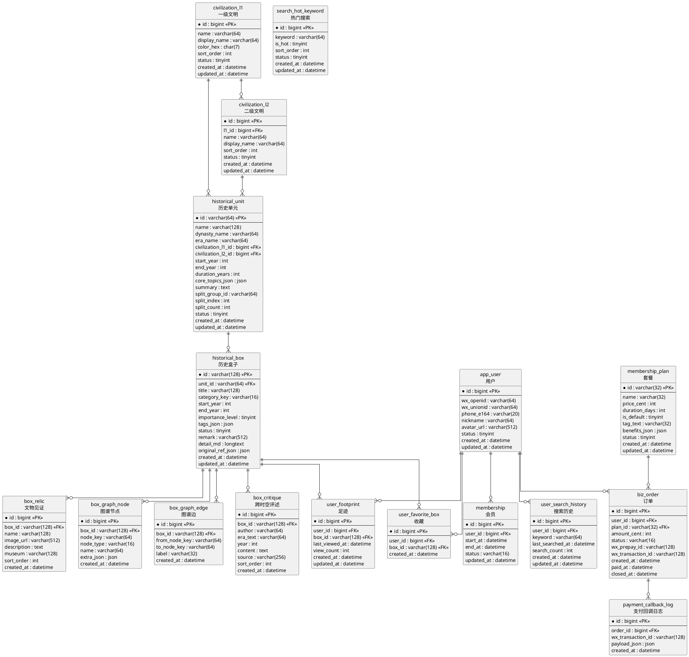

### 6.2 MySQL DDL（字段与注释完整、可直接落库）

> 约定：`utf8mb4`，时间统一 `datetime`（业务可选 `timestamp`），软删用 `status`/`deleted_at`（v1 先用 `status`）。

```sql
-- 一级文明：用于首页横轴
CREATE TABLE civilization_l1 (
  id           BIGINT PRIMARY KEY AUTO_INCREMENT COMMENT '一级文明ID',
  name         VARCHAR(64) NOT NULL COMMENT '一级文明名称（内部）',
  display_name VARCHAR(64) NOT NULL COMMENT '展示名称（如：华夏/朝鲜/地中海）',
  color_hex    CHAR(7) NOT NULL COMMENT '展示基色（#RRGGBB）',
  sort_order   INT NOT NULL DEFAULT 0 COMMENT '排序（越小越靠前）',
  status       TINYINT NOT NULL DEFAULT 1 COMMENT '状态：1=启用，0=停用',
  created_at   DATETIME NOT NULL DEFAULT CURRENT_TIMESTAMP COMMENT '创建时间',
  updated_at   DATETIME NOT NULL DEFAULT CURRENT_TIMESTAMP ON UPDATE CURRENT_TIMESTAMP COMMENT '更新时间'
) ENGINE=InnoDB DEFAULT CHARSET=utf8mb4 COMMENT='文明轴：一级文明';

-- 二级文明：用于更细维度（如：中国/日本等）
CREATE TABLE civilization_l2 (
  id           BIGINT PRIMARY KEY AUTO_INCREMENT COMMENT '二级文明ID',
  l1_id        BIGINT NOT NULL COMMENT '所属一级文明ID',
  name         VARCHAR(64) NOT NULL COMMENT '二级文明名称（内部）',
  display_name VARCHAR(64) NOT NULL COMMENT '展示名称',
  sort_order   INT NOT NULL DEFAULT 0 COMMENT '排序',
  status       TINYINT NOT NULL DEFAULT 1 COMMENT '状态：1=启用，0=停用',
  created_at   DATETIME NOT NULL DEFAULT CURRENT_TIMESTAMP COMMENT '创建时间',
  updated_at   DATETIME NOT NULL DEFAULT CURRENT_TIMESTAMP ON UPDATE CURRENT_TIMESTAMP COMMENT '更新时间',
  INDEX idx_civ2_l1 (l1_id),
  CONSTRAINT fk_civ2_l1 FOREIGN KEY (l1_id) REFERENCES civilization_l1(id)
) ENGINE=InnoDB DEFAULT CHARSET=utf8mb4 COMMENT='文明轴：二级文明';

-- 历史单元：首页二维矩阵的“卡片”与详情页hero来源
CREATE TABLE historical_unit (
  id                 VARCHAR(64) PRIMARY KEY COMMENT '历史单元ID（建议可读字符串或UUID）',
  name               VARCHAR(128) NOT NULL COMMENT '历史单元名称（如：宋神宗/罗马共和/弥生时代）',
  dynasty_name       VARCHAR(64) NULL COMMENT '朝代名称（中国体系常用；其他文明可为空）',
  era_name           VARCHAR(64) NULL COMMENT '年号备注（如：熙宁·元丰；可为空）',
  civilization_l1_id BIGINT NOT NULL COMMENT '一级文明ID（用于首页横轴）',
  civilization_l2_id BIGINT NULL COMMENT '二级文明ID（可为空）',
  start_year         INT NOT NULL COMMENT '开始年份（公元前用负数，如前221 => -221）',
  end_year           INT NOT NULL COMMENT '结束年份（公元前用负数）',
  duration_years     INT NOT NULL COMMENT '时间跨度（年）',
  core_topics_json   JSON NULL COMMENT '核心内容数组（最多2条），用于首页卡片摘要',
  summary            TEXT NULL COMMENT '历史单元简介（详情页“查看完整简介”内容）',
  split_group_id     VARCHAR(64) NULL COMMENT '同一地域同一时间多分支的分组ID（用于首页均分子单元）',
  split_index        INT NULL COMMENT '子单元序号（从0或1开始，需统一约定）',
  split_count        INT NULL COMMENT '子单元数量（用于均分渲染）',
  status             TINYINT NOT NULL DEFAULT 1 COMMENT '状态：1=发布，0=下线，2=草稿',
  created_at         DATETIME NOT NULL DEFAULT CURRENT_TIMESTAMP COMMENT '创建时间',
  updated_at         DATETIME NOT NULL DEFAULT CURRENT_TIMESTAMP ON UPDATE CURRENT_TIMESTAMP COMMENT '更新时间',
  INDEX idx_unit_civ1_time (civilization_l1_id, start_year, end_year),
  INDEX idx_unit_civ2_time (civilization_l2_id, start_year, end_year),
  INDEX idx_unit_split_group (split_group_id),
  CONSTRAINT fk_unit_civ1 FOREIGN KEY (civilization_l1_id) REFERENCES civilization_l1(id),
  CONSTRAINT fk_unit_civ2 FOREIGN KEY (civilization_l2_id) REFERENCES civilization_l2(id)
) ENGINE=InnoDB DEFAULT CHARSET=utf8mb4 COMMENT='历史单元：首页/详情页核心对象';

-- 历史盒子：详情页矩阵的“格子”，以及深度阅读的聚合根
CREATE TABLE historical_box (
  id               VARCHAR(128) PRIMARY KEY COMMENT '历史盒子ID（Excel: 历史盒子ID，可读字符串）',
  unit_id           VARCHAR(64) NOT NULL COMMENT '所属历史单元ID',
  title             VARCHAR(128) NOT NULL COMMENT '历史盒子名称（人物/事件）',
  category_key      VARCHAR(16) NOT NULL COMMENT '分类Key：junji/shichen/minlu/dianzhi/shilue',
  start_year        INT NULL COMMENT '盒子开始年份（若为具体年份事件，可等于end_year）',
  end_year          INT NULL COMMENT '盒子结束年份',
  importance_level  TINYINT NULL COMMENT '重要性评级（Excel字段：重要性评级）',
  tags_json         JSON NULL COMMENT '标签数组（Excel字段：标签）',
  status            TINYINT NOT NULL DEFAULT 1 COMMENT '状态：1=发布，0=下线，2=草稿（Excel字段：历史盒子状态可映射）',
  remark            VARCHAR(512) NULL COMMENT '备注（Excel字段：备注）',
  detail_md         LONGTEXT NULL COMMENT '详情Tab内容（Markdown/富文本）',
  original_ref_json JSON NULL COMMENT '原文对照引用（如24史条目/章节/链接等，JSON结构）',
  created_at        DATETIME NOT NULL DEFAULT CURRENT_TIMESTAMP COMMENT '创建时间',
  updated_at        DATETIME NOT NULL DEFAULT CURRENT_TIMESTAMP ON UPDATE CURRENT_TIMESTAMP COMMENT '更新时间',
  INDEX idx_box_unit_cat_year (unit_id, category_key, start_year),
  CONSTRAINT fk_box_unit FOREIGN KEY (unit_id) REFERENCES historical_unit(id)
) ENGINE=InnoDB DEFAULT CHARSET=utf8mb4 COMMENT='历史盒子：单元内细粒度内容载体';

-- 关系图谱节点（按盒子维度）
CREATE TABLE box_graph_node (
  id         BIGINT PRIMARY KEY AUTO_INCREMENT COMMENT '节点自增ID',
  box_id     VARCHAR(128) NOT NULL COMMENT '所属历史盒子ID',
  node_key   VARCHAR(64) NOT NULL COMMENT '节点业务Key（同一box内唯一）',
  node_type  VARCHAR(16) NOT NULL COMMENT '节点类型：person/event/place/work/org',
  name       VARCHAR(64) NOT NULL COMMENT '节点展示名称',
  extra_json JSON NULL COMMENT '扩展信息（可选）',
  created_at DATETIME NOT NULL DEFAULT CURRENT_TIMESTAMP COMMENT '创建时间',
  UNIQUE KEY uk_node (box_id, node_key),
  INDEX idx_node_box (box_id),
  CONSTRAINT fk_node_box FOREIGN KEY (box_id) REFERENCES historical_box(id)
) ENGINE=InnoDB DEFAULT CHARSET=utf8mb4 COMMENT='盒子关系图谱：节点';

-- 关系图谱边
CREATE TABLE box_graph_edge (
  id            BIGINT PRIMARY KEY AUTO_INCREMENT COMMENT '边自增ID',
  box_id        VARCHAR(128) NOT NULL COMMENT '所属历史盒子ID',
  from_node_key VARCHAR(64) NOT NULL COMMENT '起点node_key',
  to_node_key   VARCHAR(64) NOT NULL COMMENT '终点node_key',
  label         VARCHAR(32) NOT NULL COMMENT '边标签（如：主角/审判/营救）',
  created_at    DATETIME NOT NULL DEFAULT CURRENT_TIMESTAMP COMMENT '创建时间',
  INDEX idx_edge_box (box_id),
  CONSTRAINT fk_edge_box FOREIGN KEY (box_id) REFERENCES historical_box(id)
) ENGINE=InnoDB DEFAULT CHARSET=utf8mb4 COMMENT='盒子关系图谱：边';

-- 跨时空评述（<=5条的业务约束在应用层控制）
CREATE TABLE box_critique (
  id         BIGINT PRIMARY KEY AUTO_INCREMENT COMMENT '评述ID',
  box_id     VARCHAR(128) NOT NULL COMMENT '所属历史盒子ID',
  author     VARCHAR(64) NOT NULL COMMENT '评述人（如：朱熹）',
  era_text   VARCHAR(64) NOT NULL COMMENT '时代描述（如：南宋·1200）',
  year       INT NULL COMMENT '年份（便于排序/过滤）',
  content    TEXT NOT NULL COMMENT '评述内容',
  source     VARCHAR(256) NULL COMMENT '出处（书名/卷/章节）',
  sort_order INT NOT NULL DEFAULT 0 COMMENT '展示排序（越小越靠前）',
  created_at DATETIME NOT NULL DEFAULT CURRENT_TIMESTAMP COMMENT '创建时间',
  INDEX idx_critique_box (box_id),
  CONSTRAINT fk_critique_box FOREIGN KEY (box_id) REFERENCES historical_box(id)
) ENGINE=InnoDB DEFAULT CHARSET=utf8mb4 COMMENT='盒子评述：跨时空评述';

-- 文物见证（<=3条的业务约束在应用层控制）
CREATE TABLE box_relic (
  id          BIGINT PRIMARY KEY AUTO_INCREMENT COMMENT '文物ID',
  box_id      VARCHAR(128) NOT NULL COMMENT '所属历史盒子ID',
  name        VARCHAR(128) NOT NULL COMMENT '文物名称（如：黄州寒食帖）',
  image_url   VARCHAR(512) NULL COMMENT '图片URL（对象存储）',
  description TEXT NULL COMMENT '文物介绍',
  museum      VARCHAR(128) NULL COMMENT '馆藏信息（如：台北故宫博物院）',
  sort_order  INT NOT NULL DEFAULT 0 COMMENT '展示排序',
  created_at  DATETIME NOT NULL DEFAULT CURRENT_TIMESTAMP COMMENT '创建时间',
  INDEX idx_relic_box (box_id),
  CONSTRAINT fk_relic_box FOREIGN KEY (box_id) REFERENCES historical_box(id)
) ENGINE=InnoDB DEFAULT CHARSET=utf8mb4 COMMENT='盒子内容：文物见证';

-- 用户表
CREATE TABLE app_user (
  id          BIGINT PRIMARY KEY AUTO_INCREMENT COMMENT '用户ID',
  wx_openid   VARCHAR(64) NULL COMMENT '微信OpenID（小程序维度）',
  wx_unionid  VARCHAR(64) NULL COMMENT '微信UnionID（跨应用）',
  phone_e164  VARCHAR(20) NULL COMMENT '手机号（E.164，如+8613812345678）',
  nickname    VARCHAR(64) NOT NULL COMMENT '昵称',
  avatar_url  VARCHAR(512) NULL COMMENT '头像URL',
  status      TINYINT NOT NULL DEFAULT 1 COMMENT '状态：1=正常，0=禁用',
  created_at  DATETIME NOT NULL DEFAULT CURRENT_TIMESTAMP COMMENT '创建时间',
  updated_at  DATETIME NOT NULL DEFAULT CURRENT_TIMESTAMP ON UPDATE CURRENT_TIMESTAMP COMMENT '更新时间',
  UNIQUE KEY uk_openid (wx_openid),
  UNIQUE KEY uk_unionid (wx_unionid),
  UNIQUE KEY uk_phone (phone_e164)
) ENGINE=InnoDB DEFAULT CHARSET=utf8mb4 COMMENT='用户';

-- 收藏：用户-盒子
CREATE TABLE user_favorite_box (
  id         BIGINT PRIMARY KEY AUTO_INCREMENT COMMENT '收藏ID',
  user_id    BIGINT NOT NULL COMMENT '用户ID',
  box_id     VARCHAR(128) NOT NULL COMMENT '历史盒子ID',
  created_at DATETIME NOT NULL DEFAULT CURRENT_TIMESTAMP COMMENT '收藏时间',
  UNIQUE KEY uk_fav (user_id, box_id),
  INDEX idx_fav_user_time (user_id, created_at),
  CONSTRAINT fk_fav_user FOREIGN KEY (user_id) REFERENCES app_user(id),
  CONSTRAINT fk_fav_box FOREIGN KEY (box_id) REFERENCES historical_box(id)
) ENGINE=InnoDB DEFAULT CHARSET=utf8mb4 COMMENT='用户收藏（历史盒子维度）';

-- 足迹：盒子浏览记录
CREATE TABLE user_footprint (
  id             BIGINT PRIMARY KEY AUTO_INCREMENT COMMENT '足迹ID',
  user_id        BIGINT NOT NULL COMMENT '用户ID',
  box_id         VARCHAR(128) NOT NULL COMMENT '历史盒子ID',
  last_viewed_at DATETIME NOT NULL COMMENT '最近一次浏览时间',
  view_count     INT NOT NULL DEFAULT 1 COMMENT '浏览次数',
  created_at     DATETIME NOT NULL DEFAULT CURRENT_TIMESTAMP COMMENT '创建时间',
  updated_at     DATETIME NOT NULL DEFAULT CURRENT_TIMESTAMP ON UPDATE CURRENT_TIMESTAMP COMMENT '更新时间',
  UNIQUE KEY uk_fp (user_id, box_id),
  INDEX idx_fp_user_time (user_id, last_viewed_at),
  CONSTRAINT fk_fp_user FOREIGN KEY (user_id) REFERENCES app_user(id),
  CONSTRAINT fk_fp_box FOREIGN KEY (box_id) REFERENCES historical_box(id)
) ENGINE=InnoDB DEFAULT CHARSET=utf8mb4 COMMENT='用户足迹（历史盒子维度）';

-- 热门搜索：用于搜索页热词区（原型 SCREEN07）
CREATE TABLE search_hot_keyword (
  id         BIGINT PRIMARY KEY AUTO_INCREMENT COMMENT '热词ID',
  keyword    VARCHAR(64) NOT NULL COMMENT '关键词（展示与检索用）',
  is_hot     TINYINT NOT NULL DEFAULT 0 COMMENT '是否热门（1=热门样式）',
  sort_order INT NOT NULL DEFAULT 0 COMMENT '排序（越小越靠前）',
  status     TINYINT NOT NULL DEFAULT 1 COMMENT '状态：1=启用，0=停用',
  created_at DATETIME NOT NULL DEFAULT CURRENT_TIMESTAMP COMMENT '创建时间',
  updated_at DATETIME NOT NULL DEFAULT CURRENT_TIMESTAMP ON UPDATE CURRENT_TIMESTAMP COMMENT '更新时间',
  UNIQUE KEY uk_keyword (keyword),
  INDEX idx_hot_status_sort (status, sort_order)
) ENGINE=InnoDB DEFAULT CHARSET=utf8mb4 COMMENT='搜索：热门搜索词';

-- 搜索历史：用于搜索页“历史记录”（原型可删除单条）
CREATE TABLE user_search_history (
  id               BIGINT PRIMARY KEY AUTO_INCREMENT COMMENT '搜索历史ID',
  user_id          BIGINT NOT NULL COMMENT '用户ID',
  keyword          VARCHAR(64) NOT NULL COMMENT '搜索关键词（原文存储，不做分词）',
  last_searched_at DATETIME NOT NULL COMMENT '最近一次搜索时间',
  search_count     INT NOT NULL DEFAULT 1 COMMENT '搜索次数',
  created_at       DATETIME NOT NULL DEFAULT CURRENT_TIMESTAMP COMMENT '创建时间',
  updated_at       DATETIME NOT NULL DEFAULT CURRENT_TIMESTAMP ON UPDATE CURRENT_TIMESTAMP COMMENT '更新时间',
  UNIQUE KEY uk_user_keyword (user_id, keyword),
  INDEX idx_user_last (user_id, last_searched_at),
  CONSTRAINT fk_sh_user FOREIGN KEY (user_id) REFERENCES app_user(id)
) ENGINE=InnoDB DEFAULT CHARSET=utf8mb4 COMMENT='搜索：用户搜索历史';

-- 会员套餐
CREATE TABLE membership_plan (
  id            VARCHAR(32) PRIMARY KEY COMMENT '套餐ID（month/quarter/year）',
  name          VARCHAR(32) NOT NULL COMMENT '套餐名称（如：月度/季度/年度）',
  price_cent    INT NOT NULL COMMENT '价格（分）',
  duration_days INT NOT NULL COMMENT '有效期天数',
  is_default    TINYINT NOT NULL DEFAULT 0 COMMENT '是否默认选中（1=是）',
  tag_text      VARCHAR(32) NULL COMMENT '展示标签（如：最划算）',
  benefits_json JSON NULL COMMENT '权益文案数组（原型：解锁文明图谱/评述/文物/原文/无广告）',
  status        TINYINT NOT NULL DEFAULT 1 COMMENT '状态：1=启用，0=停用',
  created_at    DATETIME NOT NULL DEFAULT CURRENT_TIMESTAMP COMMENT '创建时间',
  updated_at    DATETIME NOT NULL DEFAULT CURRENT_TIMESTAMP ON UPDATE CURRENT_TIMESTAMP COMMENT '更新时间'
) ENGINE=InnoDB DEFAULT CHARSET=utf8mb4 COMMENT='会员套餐';

-- 会员状态（以服务端为准）
CREATE TABLE membership (
  id         BIGINT PRIMARY KEY AUTO_INCREMENT COMMENT '会员记录ID',
  user_id    BIGINT NOT NULL COMMENT '用户ID',
  start_at   DATETIME NOT NULL COMMENT '生效时间',
  end_at     DATETIME NOT NULL COMMENT '到期时间',
  status     VARCHAR(16) NOT NULL COMMENT '状态：active/expired',
  updated_at DATETIME NOT NULL DEFAULT CURRENT_TIMESTAMP ON UPDATE CURRENT_TIMESTAMP COMMENT '更新时间',
  UNIQUE KEY uk_mem_user (user_id),
  CONSTRAINT fk_mem_user FOREIGN KEY (user_id) REFERENCES app_user(id)
) ENGINE=InnoDB DEFAULT CHARSET=utf8mb4 COMMENT='会员';

-- 订单（微信支付）
CREATE TABLE biz_order (
  id               BIGINT PRIMARY KEY AUTO_INCREMENT COMMENT '订单ID',
  user_id          BIGINT NOT NULL COMMENT '用户ID',
  plan_id          VARCHAR(32) NOT NULL COMMENT '套餐ID',
  amount_cent      INT NOT NULL COMMENT '支付金额（分）',
  status           VARCHAR(16) NOT NULL COMMENT '状态：created/paid/closed/refunded',
  wx_prepay_id     VARCHAR(128) NULL COMMENT '微信预支付ID',
  wx_transaction_id VARCHAR(128) NULL COMMENT '微信交易单号（回调获得，用于幂等）',
  created_at       DATETIME NOT NULL DEFAULT CURRENT_TIMESTAMP COMMENT '创建时间',
  paid_at          DATETIME NULL COMMENT '支付完成时间',
  closed_at        DATETIME NULL COMMENT '关闭时间',
  INDEX idx_order_user_time (user_id, created_at),
  UNIQUE KEY uk_wx_txn (wx_transaction_id),
  CONSTRAINT fk_order_user FOREIGN KEY (user_id) REFERENCES app_user(id),
  CONSTRAINT fk_order_plan FOREIGN KEY (plan_id) REFERENCES membership_plan(id)
) ENGINE=InnoDB DEFAULT CHARSET=utf8mb4 COMMENT='订单';

-- 支付回调日志（审计与问题排查）
CREATE TABLE payment_callback_log (
  id               BIGINT PRIMARY KEY AUTO_INCREMENT COMMENT '回调日志ID',
  order_id         BIGINT NOT NULL COMMENT '订单ID',
  wx_transaction_id VARCHAR(128) NULL COMMENT '微信交易单号',
  payload_json     JSON NOT NULL COMMENT '回调原始报文（脱敏后存储）',
  created_at       DATETIME NOT NULL DEFAULT CURRENT_TIMESTAMP COMMENT '创建时间',
  INDEX idx_pcb_order (order_id),
  CONSTRAINT fk_pcb_order FOREIGN KEY (order_id) REFERENCES biz_order(id)
) ENGINE=InnoDB DEFAULT CHARSET=utf8mb4 COMMENT='微信支付回调日志';
```

---

## 7. 核心流程图（每个功能点都有流程体现）

> 说明：以下流程图使用 PlantUML Activity/Sequence，便于企业内评审、落库与联调。

### 7.1 首页浏览 → 进入历史单元

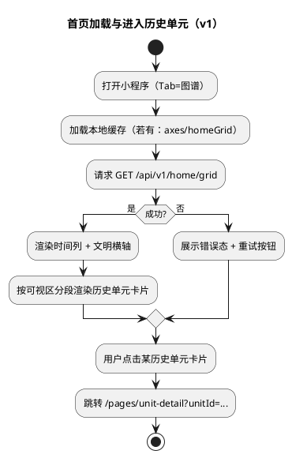

### 7.2 历史单元详情 → 盒子矩阵浏览 → 进入盒子详情

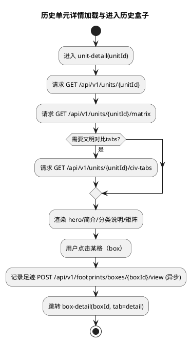

### 7.3 历史盒子详情 tabs 切换（含收藏）

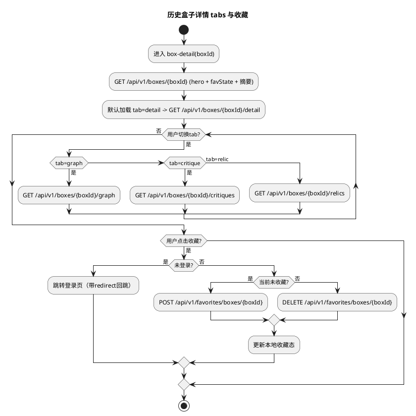

### 7.4 搜索（热门/历史记录）→ 结果页（含坐标路径）

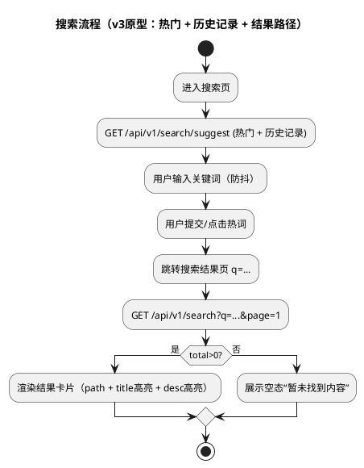

### 7.5 登录（微信/短信）与登录拦截回跳

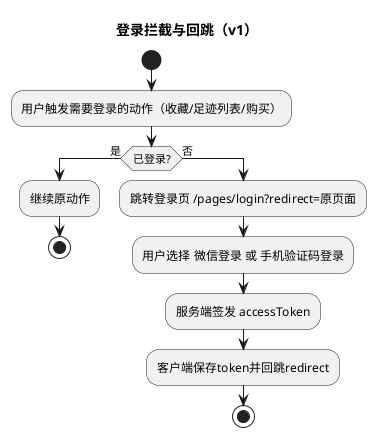

### 7.6 会员购买与微信支付（订单状态机 + 幂等回调）

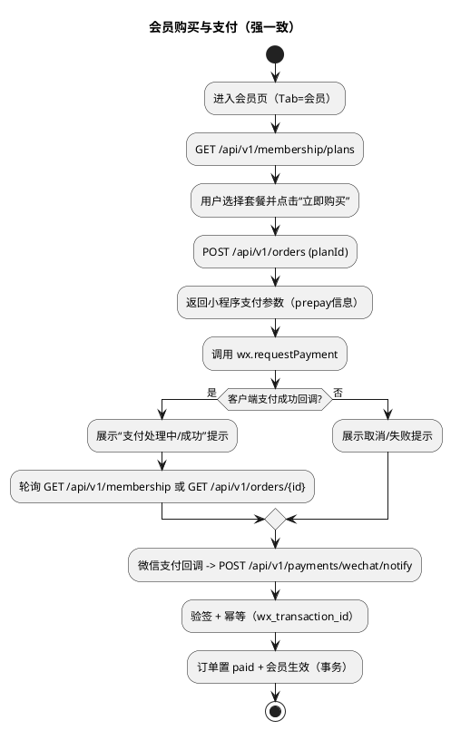

---

## 7A. 功能点详细设计（交互 ↔ 后台逻辑 ↔ 取值口径 ↔ 数据流 ↔ 时序图）

> 本章节用于把“页面交互”落到“后端用例/领域模型/SQL 口径/缓存/幂等”，并补齐**按功能的数据流向**与**时序图**，避免只停留在“接口名清单”。

### 7A.1 SCREEN01 首页 · 时空矩阵（GET `/home/grid`）

#### 7A.1.1 页面交互与后台逻辑对照表

- **进入页面 / 下拉刷新**
  - **前端行为**：拉取首页渲染所需全部数据
  - **后端用例**：`LoadHomeGridUseCase`
  - **读模型**：文明轴（横轴）+ 时间轴（纵轴）+ 单元卡片稀疏落位（cells）
  - **缓存**：Redis（见 7A.1.4）

- **点击历史单元卡片**
  - **前端行为**：导航到单元详情页
  - **后端行为**：无（单元详情页再请求）

#### 7A.1.2 字段取值口径（HomeGridDTO）

- **civilizations[]**
  - **来源**：`civilization_l1`
  - **SQL**：

```sql
SELECT id, display_name, color_hex, sort_order
FROM civilization_l1
WHERE status = 1
ORDER BY sort_order ASC;
```

- **timeAxis[]（year/label/rowHeightPx）**
  - **year**：v1 建议由“时间轴配置”生成（避免动态抽样导致前端轴频繁抖动）。可用 `application.yaml` 配置一组刻度点；后续可迁移到配置表。
  - **label**：规则：`year < 0 => "前" + abs(year)`；否则为 `String(year)`
  - **rowHeightPx**：规则（与 PRD “高度与跨度成正比 + 最小/最大高度”一致）：
    - 设该行时间跨度 `spanYears`（来自时间轴配置的相邻刻度差值或自定义）
    - \(height = clamp(round(spanYears \times k), 35, 120)\)
    - `k` 为可调系数（建议环境配置，便于视觉调参）

- **cells[]（稀疏落位）**
  - **生成原则**：只返回“有卡片的格子”，不返回全矩阵空格，减少 payload。
  - **unitCard 字段来源**：`historical_unit`
    - `title`：`historical_unit.name`
    - `note`：优先取 `core_topics_json[0]`（若为空则不返回）
    - `meta`：`duration_years + " 年"`（是否展示由前端决定；原型存在 meta 样式）
    - `variant`：用于同文明不同饱和度交替（后端可按时间行奇偶给出 `light/dark`）

#### 7A.1.3 数据流向（按功能的读路径）

1. **Controller** 接收 `GET /home/grid`
2. **Application UseCase** 先查 Redis 缓存（命中直接返回）
3. **缓存未命中**：
   - 读文明轴 `civilization_l1`
   - 读历史单元 `historical_unit`（status=1）
   - 组装 DTO：timeAxis（配置）+ civilizations + cells（稀疏）
4. 写 Redis，返回给前端

#### 7A.1.3A 缓存与失效策略（v1 默认闭环）

- **缓存对象**
  - 首页：`GET /home/grid` → key：`home:grid:v1`
- **TTL**
  - v1 默认：10 分钟（与时序图一致）
- **主动失效（推荐，避免“发布后要等 TTL”）**
  - 当 `civilization_l1` 或 `historical_unit` 有发布态变更（新增/更新/下线）时，后台管理/导入工具必须触发清缓存：
    - 删除 `home:grid:v1`
- **一致性口径**
  - v1 允许最终一致（分钟级）；不要求强一致

#### 7A.1.4 时序图（Sequence）

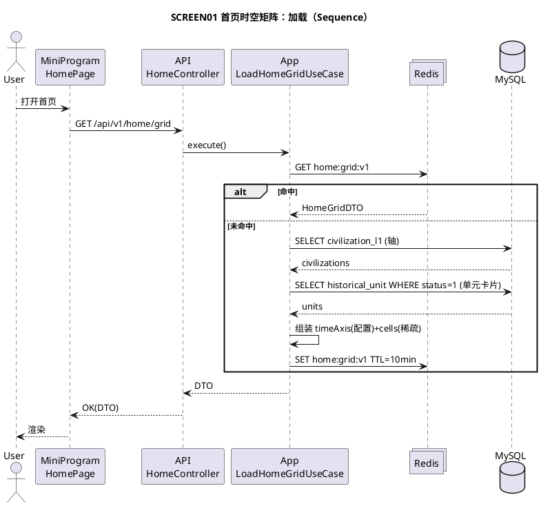

#### 7A.1.5 首页时空矩阵渲染硬规格（小程序端不返工）

##### 7A.1.5.1 轴与滚动（必须一致）

- **纵轴（时间列）**
  - 由后端 `timeAxis[]` 决定：一条 timeAxis = 一行
  - 时间列固定在左侧，不随横向文明滚动
- **横轴（文明列）**
  - 由后端 `civilizations[]` 决定：一条 civilization = 一列
  - 文明列区域支持横向滚动；横向滚动只影响文明列，不影响时间列
- **行对齐规则**
  - 同一 `timeYear` 的这一行：时间列 cell 高度必须等于该行文明区域 row 的高度（使用 `timeAxis.rowHeightPx` 作为单一事实源）

##### 7A.1.5.2 卡片布局与最小可读性（必须写死阈值）

- **卡片最小高度**：由后端保证 `rowHeightPx >= 35`
- **卡片信息降级规则（防止小格子塞不下）**
  - 当 `rowHeightPx < 48`：仅展示 `title`
  - 当 `48 <= rowHeightPx < 72`：展示 `title + meta`
  - 当 `rowHeightPx >= 72`：展示 `title + note + meta`
- **同格多分支均分（split）**
  - 若后端返回 `split_count > 1`：前端将该格子横向均分成 `split_count` 个子卡片
  - 子卡片最小宽度阈值：`minWidth=56px`
    - 若均分后宽度 < 56px：只展示 `title`（不展示 note/meta）

##### 7A.1.5.3 性能与虚拟化（小程序必做）

- **渲染策略**
  - timeAxis 行数 > 40 时必须做纵向虚拟列表（仅渲染可视区 + buffer）
  - 文明列数 > 10 时建议做横向虚拟化（或分段渲染）
- **cells 稀疏渲染**
  - 后端只返回有内容的 cells；前端只在对应坐标渲染卡片，其余保持空白背景块（不创建大量空节点）

### 7A.2 SCREEN02 历史单元详情（GET `/units/{id}` + `/matrix` + `/civ-tabs`）

#### 7A.2.1 页面交互与后台逻辑对照表

- **进入页面**
  - **前端**：并行拉取 hero、matrix、civ-tabs
  - **后端用例**：
    - `LoadUnitHeroUseCase`（单元基础信息 + 分类说明）
    - `LoadUnitMatrixUseCase`（年份×分类落位）
    - `LoadUnitCivTabsUseCase`（顶部文明对比 tabs）

- **点击“查看完整简介”**
  - **前端**：弹半屏浮层展示 `summary`
  - **后端**：无（summary 已随 hero 返回完整）

#### 7A.2.2 字段取值口径（UnitHeroDTO）

- **crumbText（原型：华夏文明 · 中国 · 宋）**
  - **来源**：`historical_unit` join `civilization_l1/l2`
  - **拼接规则**：按顺序拼接非空字段，用 ` · ` 分隔

- **unitSub（年号）**
  - 规则：若 `era_name` 非空，返回 `年号 ${era_name}`；否则不返回该字段（前端不显示）

#### 7A.2.3 字段取值口径（UnitMatrixDTO）

- **years[]**
  - v1 规则：优先取 `historical_box.start_year` 去重排序；若该单元无盒子，则回退生成刻度
- **items[] 的唯一性**
  - 同一 (year, category_key) 若多条盒子：按 `importance_level desc, id asc` 选 1 条作为格子展示（其余作为后续“更多”扩展点）
- **highlight**
  - v1 规则：`importance_level >= 4 => true`（与原型高亮格一致）

#### 7A.2.4 时序图（Sequence）

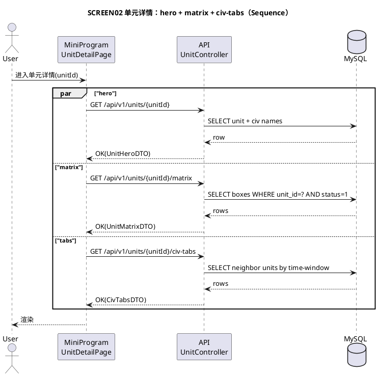

#### 7A.2.5 单元矩阵落位硬规格（年份×五类分类）

##### 7A.2.5.1 年份刻度（years[]）粒度与上限

- **v1 默认粒度**：按年（`year = historical_box.start_year` 去重）
- **上限与降级**
  - 当 years 去重后 > 60 行：后端必须聚合（例如按 2 年/5 年一组），返回 `label="{start}~{end}"`，并保证行数 <= 60

##### 7A.2.5.2 同格多盒子（冲突）稳定规则

- 同一 `(year, categoryKey)` 多条盒子：
  - **后端选择**：`importance_level desc, id asc` 取 1 条写入 `items[]`
  - **前端不做二次选择**，避免口径漂移
- 预留扩展（v2）：后端可加 `cellCount`（格子总数），前端显示角标

##### 7A.2.5.3 高亮样式等级（v1）

- `highlight=true`：使用高亮样式（描边/更亮）
- 可选：后端返回 `importanceLevel(1~5)` 用于未来不同强度高亮（v1 可不返回）

#### 7A.2.6 civ-tabs（同年代文明对比）选取规则（避免后端/前端理解不一致）

> 原型顶部 tabs 的关键是“同一时期对比”，v1 必须给出可实现且稳定的取值口径。

- **输入**：当前 `unitId`
- **输出**：`tabs[]`（按 civilization sort_order 排序，包含当前文明，且 `isActive=true`）
- **v1 选取口径（默认）**
  - 计算当前单元的中心年份：`midYear = floor((start_year + end_year) / 2)`
  - 时间窗口：`windowYears = 20`（可配置：`unit.civTabs.windowYears`）
  - 候选集：
    - `status=1`
    - `ABS(floor((start_year + end_year)/2) - midYear) <= windowYears`
  - 去重：同一 `civilization_l1_id` 若命中多条，选取距离 `midYear` 最近的一条；距离相同取 `duration_years` 更大者
- **无相邻文明**
  - 若候选集中只有当前文明：仅返回 1 个 tab，前端禁用滑动切换（文档 AC4）
- **SQL 参考（示意）**
  - 可先查候选，再在应用层做去重与最近距离选择（避免复杂 SQL 难维护）

### 7A.3 SCREEN03-06 历史盒子详情（GET `/boxes/*` + 收藏 + 足迹）

#### 7A.3.1 交互点 → 后端逻辑

- **进入盒子详情**
  - **前端**：先拉 header（含收藏态），再拉默认 tab=详情
  - **后端**：
    - `GET /boxes/{id}`：header + `isFavorite` + tabSummary
    - `GET /boxes/{id}/detail`：详情正文 + 原文引用
  - **并行写**：`POST /footprints/boxes/{id}/view`（幂等 upsert）

- **切换 tab**
  - graph：`GET /boxes/{id}/graph`
  - critique：`GET /boxes/{id}/critiques`
  - relic：`GET /boxes/{id}/relics`

- **收藏心形**
  - 未登录：跳转登录（带 redirect 回跳）
  - 已登录：POST 收藏 / DELETE 取消（均幂等）

#### 7A.3.2 字段取值口径

- **subText（原型：1079 · 华夏 · 事略）**
  - `${yearLabel(box.start_year)} · ${civilization_l1.display_name} · ${categoryDisplayName(category_key)}`

- **tabSummary**
  - `hasGraph`：`exists(box_graph_node where box_id=?)`
  - `hasCritiques`：`exists(box_critique where box_id=?)`
  - `hasRelics`：`exists(box_relic where box_id=?)`
  - `hasOriginal`：`original_ref_json` 非空且 JSON 长度 > 0

#### 7A.3.3 时序图（含写入幂等）

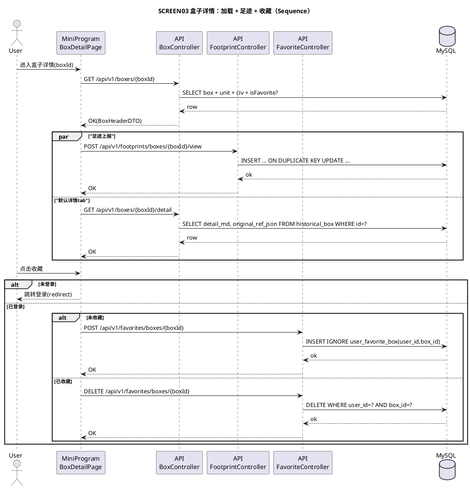

#### 7A.3.4 关系图谱展示规格（前端实现不返工的“硬规格”）

> 目标：把原型里的“中心节点 + 放射布局 + 边标签”变成可直接编码的规则，并把后端必须提供的字段写死，避免前端猜测。

##### 7A.3.4.1 布局算法（v1 固定模板，优先一致性与可控性）

- **中心节点**：固定 1 个（事件/人物/主题），由后端返回 `centerNodeKey` 指定。
- **外围节点**：v1 采用**径向模板布局**（不使用力导向），原因：小程序端性能稳定、布局可复现、避免每次渲染抖动。
- **最大展示数（v1）**
  - nodes：最多 12（含中心）
  - edges：最多 20
  - 超限策略：按 `node.weight desc`（若无 weight 则按 `node_type` 优先级 + name）截断；被截断部分不返回给前端（后端负责裁剪，避免前端“拿到也渲不动”）。
- **角度分配**
  - 外围最多 11 个，按固定角度槽位分配（顺时针）：`[-90, -55, -20, 15, 50, 85, 120, 155, 190, 225, 260]`
  - 若外点 < 11，则从 `-90` 起顺序填充
- **半径**
  - 默认 `r=140`（以 390×844 视觉区域为准），可随屏幕缩放比例微调

##### 7A.3.4.2 节点/边的渲染规则（样式与文本）

- **节点类型映射（v1）**
  - `event`：中心优先；圆形；字号 12
  - `person`：圆形；字号 11
  - `org`：圆角矩形；字号 10
  - `place`：圆角矩形；字号 10
  - `work`：圆形或胶囊；可展示 `badgeText`（如原型“(名作)”）
- **文本截断**
  - 节点主名称 `name`：最多 4 个汉字；超出截断并加 `…`
  - `badgeText`：最多 6 字符；超出截断
- **边标签（label）**
  - 展示在线段中点附近
  - 最多 4 个汉字；超出截断
  - 同一中心到外点的边若多条，v1 不支持（后端合并为 1 条带主标签）

##### 7A.3.4.3 交互规格（v1 必须明确）

- **点击节点**
  - 若节点有 `targetBoxId`：跳转到对应盒子详情（同 app 内深链接）
  - 否则：高亮该节点与其相邻边（1 秒后恢复）
- **画布手势**
  - v1：不支持自由缩放；支持轻微拖拽平移（可选）
  - 提供“重置”按钮（回到初始中心）

##### 7A.3.4.4 后端数据契约（前端不猜）

- 后端 `GET /boxes/{boxId}/graph` 必须返回：
  - `centerNodeKey`：中心节点 key
  - `nodes[]`：包含 `key/type/name/badgeText?/weight?/targetBoxId?`
  - `edges[]`：包含 `fromKey/toKey/label`
  - nodes/edges 必须已按 v1 策略裁剪到可渲染规模

##### 7A.3.4.5 失败与降级

- 若无图谱数据：返回空数组（`nodes=[] edges=[] centerNodeKey=null`），前端展示空态 “暂无关系图谱”
- 若后端判定规模过大且无法裁剪：返回 `FORBIDDEN` 不合适；应返回 `OK` + 空态，并记录告警（避免前端误判为会员锁定）

### 7A.4 SCREEN07-08 搜索（热词/历史记录/路径/高亮）

#### 7A.4.1 数据流向（读写明细）

- **进入搜索页（suggest）**
  - 读：`search_hot_keyword`（全局热词）
  - 若登录：读 `user_search_history`（个人历史记录）
- **提交搜索**
  - 若登录：写 `user_search_history`（upsert）
  - 读：盒子 + 单元检索结果，并拼接 pathText
- **删除单条历史**
  - 写：删除 `user_search_history` 对应 keyword

#### 7A.4.2 pathText 与高亮口径

- `pathText(box)`：`${civ1.display_name} › ${unit.name} › ${categoryName}`
- `pathText(unit)`：`${civ1.display_name} › ${unit.name}`
- 高亮：后端输出安全 HTML（只插入 `<em>`，其余字符必须 escape）

### 7A.5 SCREEN09 我的（个人信息/计数/退出）

#### 7A.5.1 页面交互与后台逻辑对照表

- **进入我的页**
  - **前端**：请求个人信息与计数
  - **后端用例**：`LoadMyProfileUseCase`
  - **接口**：`GET /me`

- **点击“我的足迹/我的收藏”**
  - **前端**：进入列表页并分页加载
  - **后端用例**：`ListFootprintsUseCase` / `ListFavoritesUseCase`
  - **接口**：`GET /footprints/boxes`、`GET /favorites/boxes`

- **点击退出登录**
  - **前端**：清理本地 token + 退出态 UI
  - **后端**：v1 若采用 JWT，无需服务端状态；若采用服务端 session，则提供 `POST /auth/logout`

#### 7A.5.2 字段取值口径（`GET /me`）

- **昵称/头像/手机号掩码**
  - 来源：`app_user.nickname/avatar_url/phone_e164`
  - 掩码规则（与原型一致）：大陆 11 位手机号展示 `138 **** 8888`
  - 若未绑定手机号：前端展示空或引导绑定（v1 可不做绑定流程）

- **favoriteCount**

```sql
SELECT COUNT(*) AS cnt
FROM user_favorite_box
WHERE user_id = ?;
```

- **footprintCount**

```sql
SELECT COUNT(*) AS cnt
FROM user_footprint
WHERE user_id = ?;
```

- **membershipStatus**
  - 来源：`membership`
  - 规则：无记录 => `NONE`；`end_at < now()` => `EXPIRED`；否则 `ACTIVE`

#### 7A.5.3 时序图（Sequence）

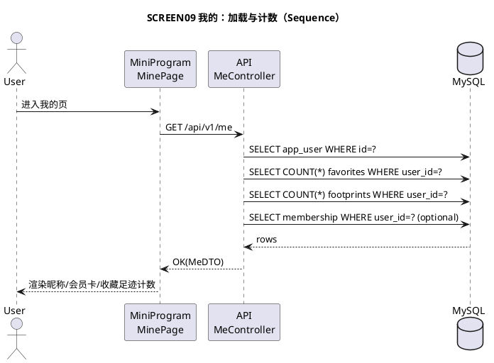

### 7A.6 SCREEN10 会员购买（套餐/下单/支付/状态刷新）

#### 7A.6.1 页面交互与后台逻辑对照表

- **进入会员页**
  - **前端**：拉套餐 + 当前会员状态
  - **后端用例**：`ListPlansUseCase`、`GetMembershipUseCase`
  - **接口**：`GET /membership/plans`、`GET /membership`

- **选择套餐并点击“立即购买”**
  - **前端**：创建订单拿支付参数 → 调 `wx.requestPayment`
  - **后端用例**：`CreateOrderUseCase`（强一致：创建订单 + 调微信统一下单）
  - **接口**：`POST /orders`

- **支付完成后的状态刷新**
  - **前端**：轮询 `GET /membership` 或 `GET /orders/{id}`
  - **后端**：以微信回调为准更新订单与会员
  - **接口**：`POST /payments/wechat/notify`

#### 7A.6.2 字段取值口径（套餐与权益）

- **套餐列表**

```sql
SELECT id, name, price_cent, duration_days, is_default, tag_text, benefits_json
FROM membership_plan
WHERE status = 1
ORDER BY is_default DESC, price_cent ASC;
```

- **权益展示**
  - 来源：`membership_plan.benefits_json`（与原型权益文案一致）
  - 说明：权益“是否真正解锁”的 gating 规则在后端用统一函数判断（例如 `requiresMembership`），避免散落在前端。

#### 7A.6.3 订单创建与幂等（取值/写入逻辑）

- 创建订单（事务边界在应用层）
  1. 校验 `planId` 存在且启用
  2. 写 `biz_order(status=created, amount_cent=plan.price_cent)`
  3. 调微信统一下单得到 `wx_prepay_id` 与签名参数
  4. 更新订单写入 `wx_prepay_id`
  5. 返回支付参数

- 幂等与重试
  - `POST /orders` 不做天然幂等（用户可重复下单），但可在应用层增加“同 user 同 plan 最近 N 分钟未支付订单复用”策略（需产品确认）
  - 微信回调必须幂等：以 `wx_transaction_id` 唯一索引防重

#### 7A.6.4 时序图（Sequence）

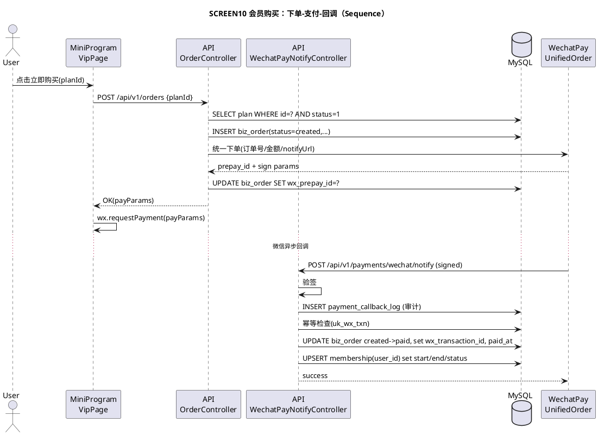

### 7A.7 SCREEN11 登录（微信/短信/回跳/频控）

#### 7A.7.1 页面交互与后台逻辑对照表

- **微信登录**
  - **前端**：`wx.login()` 获取 `code` → `POST /auth/wx-login`
  - **后端用例**：`WxLoginUseCase`（code 换 openid/unionid → upsert 用户 → 签发 token）

- **短信验证码登录**
  - **前端**：`POST /auth/sms/send` 获取验证码 → `POST /auth/sms/login`
  - **后端用例**：`SendSmsCodeUseCase`、`SmsLoginUseCase`
  - **频控**：同手机号/同 IP 限制（必须）

- **登录拦截回跳**
  - **前端**：携带 `redirect`（原页面 path + query）
  - **后端**：无特殊逻辑（token 下发即可）；回跳由前端完成

#### 7A.7.2 安全与风控要点（v1 最小）

- 短信发送频控建议（可配置）
  - 同手机号：60 秒内最多 1 次；24 小时内最多 10 次
  - 同 IP：1 分钟内最多 5 次
- 验证码有效期：5 分钟
- 验证码校验失败次数：超过阈值（如 5 次）短暂封禁（如 10 分钟）

#### 7A.7.3 时序图（Sequence）

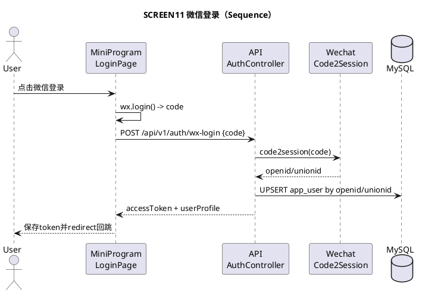

## 8. 接口设计（标准化、单一职责、可联调）

### 8.1 通用约定

- **Base URL**：`/api/v1`
- **鉴权**：`Authorization: Bearer <accessToken>`
- **返回格式**

```json
{
  "code": "OK",
  "message": "success",
  "requestId": "trace-id",
  "data": {}
}
```

- **错误码（示例，需实现时固化）**
  - `OK`
  - `INVALID_ARGUMENT`
  - `UNAUTHORIZED`
  - `FORBIDDEN`
  - `NOT_FOUND`
  - `CONFLICT`
  - `RATE_LIMITED`
  - `INTERNAL_ERROR`

#### 8.1.1 错误码表（企业级：可验收、可排障）

| code | HTTP | 使用场景（必读口径） | message 示例 | 客户端处理建议 |
|---|---:|---|---|---|
| OK | 200 | 成功 | success | 正常渲染 |
| INVALID_ARGUMENT | 400 | 入参校验失败（缺字段/越界/枚举不合法） | invalid planId | toast + 纠正输入 |
| UNAUTHORIZED | 401 | 未登录或 token 过期 | login required | 跳登录页（带 redirect 回跳） |
| FORBIDDEN | 403 | 已登录但无权限（例如内容需会员） | membership required | 引导开通会员/提示无权限 |
| NOT_FOUND | 404 | unitId/boxId/orderId 不存在或已下线 | box not found | 空态页 + 返回 |
| CONFLICT | 409 | 状态机冲突/重复提交导致冲突（如支付回调非法转换） | order status conflict | 客户端提示“稍后重试”，并提供刷新 |
| RATE_LIMITED | 429 | 频控/限流（短信、搜索） | rate limited | 倒计时/稍后再试 |
| INTERNAL_ERROR | 500 | 未预期错误 | internal error | 统一错误页 + requestId 上报 |

#### 8.1.2 通用入参校验规范（所有接口统一口径）

- **ID 类字段**
  - `unitId`：1~64（字母数字、下划线/短横线）
  - `boxId`：1~128（字母数字、下划线/短横线）
  - `orderId`：正整数
- **分页**
  - `page`：>=1，默认 1
  - `pageSize`：1~50，默认 20
- **搜索**
  - `q`：trim 后长度 1~32（超出直接 `INVALID_ARGUMENT`）
  - 过滤：拒绝全是通配符/空白；避免 `LIKE` 滥用导致慢查询

#### 8.1.3 通用字段字典（关键展示字段的统一来源）

- **yearLabel(year:int)**：`year < 0 ? "前"+abs(year) : String(year)`
- **categoryName(categoryKey)**：`junji=君纪, shichen=士臣, minlu=民录, dianzhi=典制, shilue=事略`
- **box.subText**：`${yearLabel(startYear)} · ${civ1.display_name} · ${categoryName(categoryKey)}`
- **unit.crumbText**：`${civ1.display_name} · ${civ2.display_name?} · ${dynasty_name?}`（空值跳过）

#### 8.1.4 示例：错误返回

```json
{
  "code": "UNAUTHORIZED",
  "message": "login required",
  "requestId": "8f2a6b7e2d2b4d3a",
  "data": null
}
```

### 8.2 内容图谱（首页/单元/盒子）

#### 8.2.1 首页二维网格

- **GET `/home/grid`**
  - **职责**：一次返回首页渲染所需 timeAxis + civilizations + 稀疏 cells
  - **Query**：可选 `civCountLimit`（用于灰度展示数量），`sinceVersion`（客户端缓存协商）
  - **Response.data**
    - `timeAxis[]`: `{year,label,rowHeightPx}`
    - `civilizations[]`: `{id,displayName,colorHex,sortOrder}`
    - `cells[]`: `{timeYear,civId,unitCard|null}`
    - `unitCard`: `{unitId,title,note?,meta?,startYear,endYear,durationYears,variant?}`
  - **取值口径**：见 **7A.1.2**
  - **示例响应（节选，稀疏 cells）**

```json
{
  "code": "OK",
  "message": "success",
  "requestId": "req_home_001",
  "data": {
    "timeAxis": [
      { "year": -221, "label": "前221", "rowHeightPx": 48 },
      { "year": -206, "label": "前206", "rowHeightPx": 80 },
      { "year": 9, "label": "9", "rowHeightPx": 40 }
    ],
    "civilizations": [
      { "id": 1, "displayName": "华夏", "colorHex": "#C42828", "sortOrder": 1 },
      { "id": 2, "displayName": "朝鲜", "colorHex": "#5B8DEF", "sortOrder": 2 }
    ],
    "cells": [
      {
        "timeYear": -221,
        "civId": 1,
        "unitCard": {
          "unitId": "huaxia_qinshihuang",
          "title": "秦始皇",
          "note": "统一六国",
          "meta": "15 年",
          "startYear": -221,
          "endYear": -206,
          "durationYears": 15,
          "variant": "light"
        }
      }
    ]
  }
}
```

#### 8.2.2 历史单元详情（hero + 简介）

- **GET `/units/{unitId}`**
  - **职责**：返回单元基础信息（原型 hero + intro）
  - **Response.data**
    - `unit`: `{id,name,crumbText,eraText?,startYear,endYear,durationYears,summary}`
    - `categoryTips[]`: 五类分类说明 `{key,name,desc}`
  - **取值口径**：见 **7A.2.2**
  - **示例响应**

```json
{
  "code": "OK",
  "message": "success",
  "requestId": "req_unit_001",
  "data": {
    "unit": {
      "id": "huaxia_song_shenzong",
      "name": "宋神宗",
      "crumbText": "华夏文明 · 中国 · 宋",
      "eraText": "年号 熙宁 · 元丰",
      "startYear": 1067,
      "endYear": 1085,
      "durationYears": 18,
      "summary": "宋神宗赵顼……（完整简介字符串，前端2行折叠展示）"
    },
    "categoryTips": [
      { "key": "junji", "name": "君纪", "desc": "帝王本纪、君主世系、登基册立……" },
      { "key": "shichen", "name": "士臣", "desc": "将相列传、名臣政绩、文人士大夫……" }
    ]
  }
}
```

#### 8.2.3 历史单元矩阵（年份×分类）

- **GET `/units/{unitId}/matrix`**
  - **职责**：只返回矩阵落位数据（单一职责）
  - **Response.data**
    - `years[]`: `{year,label}`
    - `categories[]`: `{key,name}`
    - `items[]`: `{boxId,year,categoryKey,title,highlight}`
  - **取值口径**：见 **7A.2.3**
  - **示例响应（节选）**

```json
{
  "code": "OK",
  "message": "success",
  "requestId": "req_matrix_001",
  "data": {
    "years": [
      { "year": 1067, "label": "1067" },
      { "year": 1079, "label": "1079" }
    ],
    "categories": [
      { "key": "junji", "name": "君纪" },
      { "key": "shilue", "name": "事略" }
    ],
    "items": [
      { "boxId": "box_dengji_1067", "year": 1067, "categoryKey": "junji", "title": "登基", "highlight": true },
      { "boxId": "box_wutai_1079", "year": 1079, "categoryKey": "shilue", "title": "乌台诗案", "highlight": true }
    ]
  }
}
```

#### 8.2.4 文明对比 tabs（同一时期相邻单元）

- **GET `/units/{unitId}/civ-tabs`**
  - **职责**：返回顶部可横滑的对比 tabs（原型）
  - **Response.data**
    - `tabs[]`: `{civilizationId,civilizationName,unitId,isActive}`

#### 8.2.5 历史盒子（聚合入口）

- **GET `/boxes/{boxId}`**
  - **职责**：返回盒子 hero + 当前用户收藏态（若已登录）+ tab 可用性摘要
  - **Response.data**
    - `box`: `{id,title,subText,categoryKey,startYear,endYear}`
    - `isFavorite`: `true|false`
    - `tabSummary`: `{hasGraph,hasCritiques,hasRelics,hasOriginal}`
    - `access`：会员 gating 信息（见 **8.5.1**）
      - `access.boxLocked`：boolean（盒子整体是否锁定，v1 默认 false）
      - `access.tabs`：每个 tab 的锁定信息（graph/critique/relic/original）
        - `locked`：boolean
        - `lockedReason?`：`MEMBERSHIP_REQUIRED`
        - `unlockAction?`：`{type:'OPEN_VIP_PAGE'}`
  - **字段来源字典（v1）**
    - `box.id/title/categoryKey/startYear/endYear`：`historical_box`
    - `box.subText`：见 **8.1.3 box.subText**
    - `isFavorite`：`exists(user_favorite_box where user_id=? and box_id=?)`
    - `tabSummary.*`：
      - `hasGraph`：`exists(box_graph_node where box_id=?)`
      - `hasCritiques`：`exists(box_critique where box_id=?)`
      - `hasRelics`：`exists(box_relic where box_id=?)`
      - `hasOriginal`：`historical_box.original_ref_json` 非空且 JSON 长度 > 0
  - **示例响应**

```json
{
  "code": "OK",
  "message": "success",
  "requestId": "req_box_001",
  "data": {
    "box": {
      "id": "box_wutai_1079",
      "title": "乌台诗案",
      "subText": "1079 · 华夏 · 事略",
      "categoryKey": "shilue",
      "startYear": 1079,
      "endYear": 1079
    },
    "isFavorite": false,
    "tabSummary": { "hasGraph": true, "hasCritiques": true, "hasRelics": true, "hasOriginal": true },
    "access": {
      "boxLocked": false,
      "tabs": {
        "graph":    { "locked": false },
        "critique": { "locked": true, "lockedReason": "MEMBERSHIP_REQUIRED", "unlockAction": { "type": "OPEN_VIP_PAGE" } },
        "relic":    { "locked": true, "lockedReason": "MEMBERSHIP_REQUIRED", "unlockAction": { "type": "OPEN_VIP_PAGE" } },
        "original": { "locked": true, "lockedReason": "MEMBERSHIP_REQUIRED", "unlockAction": { "type": "OPEN_VIP_PAGE" } }
      }
    }
  }
}
```

- **GET `/boxes/{boxId}/detail`**
  - **职责**：详情 tab 正文 + 原文对照入口信息
  - **Response.data**
    - `detailMd`
    - `originalRef`（结构化 JSON：来源、卷、章节、链接等）
  - **会员 gating（v1）**
    - 若该内容被锁定：返回 `FORBIDDEN`，响应体见 **8.5.1**
  - **字段来源字典（v1）**
    - `detailMd`：`historical_box.detail_md`
    - `originalRef`：`historical_box.original_ref_json`
  - **示例响应（节选）**

```json
{
  "code": "OK",
  "message": "success",
  "requestId": "req_box_detail_001",
  "data": {
    "detailMd": "苏轼是个倒霉孩子……",
    "originalRef": {
      "title": "24史原文对照",
      "items": [
        { "work": "宋史", "chapter": "苏轼传", "url": "https://example.com/..." }
      ]
    }
  }
}
```

- **GET `/boxes/{boxId}/graph`**
  - **职责**：关系图谱（nodes/edges）
  - **Response.data**
    - `centerNodeKey`: `string|null`
    - `nodes[]`: `{key,type,name,badgeText?,weight?,targetBoxId?}`
    - `edges[]`: `{fromKey,toKey,label}`
  - **会员 gating（v1）**
    - 若 `access.tabs.graph.locked=true`：返回 `FORBIDDEN`
  - **字段来源字典（v1）**
    - `nodes`：`box_graph_node`（`node_key/node_type/name`）
    - `edges`：`box_graph_edge`（`from_node_key/to_node_key/label`）
    - `centerNodeKey`：见 **7A.3.4.4**（后端返回中心节点key，前端固定放中心）
  - **示例响应（节选）**

```json
{
  "code": "OK",
  "message": "success",
  "requestId": "req_box_graph_001",
  "data": {
    "centerNodeKey": "event_wutai",
    "nodes": [
      { "key": "event_wutai", "type": "event", "name": "乌台诗案", "weight": 100 },
      { "key": "person_sushi", "type": "person", "name": "苏轼", "targetBoxId": "box_sushi_1079", "weight": 80 },
      { "key": "work_hanshitie", "type": "work", "name": "寒食帖", "badgeText": "(名作)", "weight": 60 }
    ],
    "edges": [
      { "fromKey": "event_wutai", "toKey": "person_sushi", "label": "主角" }
    ]
  }
}
```

- **GET `/boxes/{boxId}/critiques`**
  - **职责**：跨时空评述列表（<=5）
  - **会员 gating（v1）**
    - 若 `access.tabs.critique.locked=true`：返回 `FORBIDDEN`
  - **字段来源字典（v1）**
    - 来源表：`box_critique`
    - 排序：`sort_order asc`，同序按 `id asc`
    - 数量限制：最多返回 `box.critiques.maxCount`（默认 5）
  - **示例响应**

```json
{
  "code": "OK",
  "message": "success",
  "requestId": "req_box_critiques_001",
  "data": {
    "items": [
      {
        "author": "朱熹",
        "eraText": "南宋 · 1200",
        "year": 1200,
        "content": "轼之狱，非为诗也，为党议也……",
        "source": "《朱子语类》卷一三一"
      }
    ]
  }
}
```

- **GET `/boxes/{boxId}/relics`**
  - **职责**：文物见证列表（<=3）
  - **会员 gating（v1）**
    - 若 `access.tabs.relic.locked=true`：返回 `FORBIDDEN`
  - **字段来源字典（v1）**
    - 来源表：`box_relic`
    - 排序：`sort_order asc`，同序按 `id asc`
    - 数量限制：最多返回 `box.relics.maxCount`（默认 3）
  - **示例响应**

```json
{
  "code": "OK",
  "message": "success",
  "requestId": "req_box_relics_001",
  "data": {
    "items": [
      {
        "name": "黄州寒食帖",
        "imageUrl": "https://example.com/relics/hs.jpg",
        "description": "苏轼被贬黄州第三年寒食节所写……",
        "museum": "台北故宫博物院"
      }
    ]
  }
}
```

### 8.3 搜索

- **GET `/search/suggest`**
  - **职责**：热门搜索 + 历史记录（原型 SCREEN07）
  - **Auth**：可选（未登录仅返回热门搜索；登录返回历史记录）
  - **取值口径（v1）**
    - 热门搜索：来自 `search_hot_keyword`（`status=1`，`sort_order asc`，默认 `LIMIT 50`）
    - 搜索历史（登录态）：来自 `user_search_history`（`user_id=当前用户`，`last_searched_at desc`，默认 `LIMIT 20`）
  - **数据流**
    - 读 MySQL → 组装 `{hotKeywords[], historyKeywords[]}` → 返回
  - **示例响应**

```json
{
  "code": "OK",
  "message": "success",
  "requestId": "req_suggest_001",
  "data": {
    "hotKeywords": [
      { "keyword": "王安石变法", "isHot": true },
      { "keyword": "乌台诗案", "isHot": false }
    ],
    "historyKeywords": [
      { "keyword": "苏轼", "lastSearchedAt": "2026-04-26T22:30:00+08:00" }
    ]
  }
}
```

- **GET `/search`**
  - **职责**：搜索（返回 total + items，items 含坐标路径）
  - **Query**：`q`（必填）、`page`、`pageSize`
  - **Response.data**
    - `total`
    - `items[]`: `{type:'box'|'unit',id,pathText,titleHighlight,descHighlight}`
  - **取值口径（v1）**
    - `q` 预处理：trim + 长度限制（建议 1~32）+ 特殊字符过滤（避免 LIKE 通配滥用）
    - 盒子匹配：`historical_box.title LIKE %q%`（可选：`tags_json` 增强匹配）
    - 单元匹配：`historical_unit.name/dynasty_name/era_name LIKE %q%`
    - `pathText` 生成规则：见 **7A.4.2**
    - 排序建议：盒子优先，其次按 `importance_level desc`、再按 `start_year asc`
  - **副作用（登录态）**
    - 写搜索历史：对 `user_search_history` 执行 upsert（`last_searched_at=now()`，`search_count=search_count+1`）
  - **示例响应（节选）**

```json
{
  "code": "OK",
  "message": "success",
  "requestId": "req_search_001",
  "data": {
    "total": 8,
    "page": 1,
    "pageSize": 20,
    "items": [
      {
        "type": "box",
        "id": "box_wutai_1079",
        "pathText": "华夏 › 宋神宗 › 事略",
        "titleHighlight": "乌台<em>诗案</em>",
        "descHighlight": "元丰二年，<em>苏轼</em>任湖州知州时所作谢表被弹劾……"
      }
    ]
  }
}
```

- **DELETE `/search/history`**
  - **职责**：删除单条搜索历史（原型：历史记录条目右侧 ✕）
  - **鉴权**：必须
  - **Query（两种口径二选一，v1 建议用 keyword）**
    - `keyword`：要删除的关键词（trim 后 1~64）
  - **写入逻辑（v1）**
    - `DELETE FROM user_search_history WHERE user_id=? AND keyword=?`
    - 幂等：不存在也返回 OK
  - **示例**
    - `DELETE /api/v1/search/history?keyword=%E8%8B%8F%E8%BD%BC`
  - **示例响应**

```json
{
  "code": "OK",
  "message": "success",
  "requestId": "req_del_hist_001",
  "data": {}
}
```

### 8.4 用户、收藏、足迹

- **POST `/auth/wx-login`**
  - **职责**：微信登录换取 accessToken
  - **请求**
    - `code`：微信 `wx.login()` 返回 code（必填）
  - **取值/逻辑（v1）**
    - 调微信 `code2session` 换取 `openid/unionid`
    - `app_user` 按 `wx_openid` upsert（不存在则创建）
    - 签发 `accessToken`（JWT 或 session token）
  - **响应**
    - `accessToken`、`expiresIn`、`userProfile`
  - **示例响应**

```json
{
  "code": "OK",
  "message": "success",
  "requestId": "req_login_001",
  "data": {
    "accessToken": "eyJhbGciOi...",
    "expiresIn": 2592000,
    "userProfile": { "userId": 123, "nickname": "雄哥", "avatarUrl": "https://example.com/a.png" }
  }
}
```

- **POST `/auth/sms/send`**、**POST `/auth/sms/login`**
  - **职责**：手机号验证码登录（频控/风控必须）
  - **入参校验（v1）**
    - `phone`：仅允许大陆手机号或 E.164（需要统一口径）
    - `captcha`：图形验证码（可选，若开启风控）
  - **风控规则（v1 最小）**
    - 同手机号 60s 1次、24h 10次；同IP 60s 5次（可配置）

- **GET `/me`**
  - **职责**：我的页头部信息 + 计数 + 会员状态摘要
  - **鉴权**：必须
  - **取值口径**：见 **7A.5.2**
  - **响应字段**
    - `nickname`、`avatarUrl`、`phoneMasked`
    - `favoriteCount`、`footprintCount`
    - `membershipStatus`（NONE/ACTIVE/EXPIRED）与 `membershipEndAt?`
  - **示例响应**

```json
{
  "code": "OK",
  "message": "success",
  "requestId": "req_me_001",
  "data": {
    "nickname": "雄哥",
    "avatarUrl": "https://example.com/avatar.png",
    "phoneMasked": "138 **** 8888",
    "favoriteCount": 23,
    "footprintCount": 127,
    "membershipStatus": "NONE",
    "membershipEndAt": null
  }
}
```

- **POST `/favorites/boxes/{boxId}`**
  - **职责**：收藏盒子（幂等：重复收藏返回 OK）
  - **鉴权**：必须
  - **写入逻辑（v1）**
    - `INSERT IGNORE INTO user_favorite_box(user_id, box_id, created_at)`
  - **示例响应**

```json
{ "code": "OK", "message": "success", "requestId": "req_fav_001", "data": {} }
```

- **DELETE `/favorites/boxes/{boxId}`**
  - **职责**：取消收藏（幂等：重复取消返回 OK）
  - **鉴权**：必须
  - **写入逻辑（v1）**
    - `DELETE FROM user_favorite_box WHERE user_id=? AND box_id=?`
  - **示例响应**

```json
{ "code": "OK", "message": "success", "requestId": "req_unfav_001", "data": {} }
```

- **GET `/favorites/boxes`**
  - **职责**：收藏列表（分页）
  - **鉴权**：必须
  - **Query**
    - `page`（默认 1）、`pageSize`（默认 20，上限 50）
  - **取值口径（v1）**
    - 以 `user_favorite_box.created_at desc` 排序
    - join `historical_box` 补齐 `title/subText/categoryKey`
  - **示例响应（节选）**

```json
{
  "code": "OK",
  "message": "success",
  "requestId": "req_fav_list_001",
  "data": {
    "page": 1,
    "pageSize": 20,
    "total": 23,
    "items": [
      {
        "boxId": "box_wutai_1079",
        "title": "乌台诗案",
        "subText": "1079 · 华夏 · 事略",
        "categoryKey": "shilue",
        "favoritedAt": "2026-04-26T22:00:00+08:00"
      }
    ]
  }
}
```

- **POST `/footprints/boxes/{boxId}/view`**
  - **职责**：记录足迹（幂等：同 user+box upsert，累加 viewCount、更新时间）
  - **鉴权**：必须（原型中“足迹/收藏”入口要求登录）
  - **写入逻辑（v1）**
    - `INSERT ... ON DUPLICATE KEY UPDATE last_viewed_at=NOW(), view_count=view_count+1`
  - **示例响应**

```json
{ "code": "OK", "message": "success", "requestId": "req_fp_upsert_001", "data": {} }
```

- **GET `/footprints/boxes`**
  - **职责**：足迹列表（分页）
  - **鉴权**：必须
  - **Query**
    - `page`（默认 1）、`pageSize`（默认 20，上限 50）
  - **取值口径（v1）**
    - 以 `user_footprint.last_viewed_at desc` 排序
    - join `historical_box` 补齐 `title/subText/categoryKey`
  - **示例响应（节选）**

```json
{
  "code": "OK",
  "message": "success",
  "requestId": "req_fp_list_001",
  "data": {
    "page": 1,
    "pageSize": 20,
    "total": 127,
    "items": [
      {
        "boxId": "box_wutai_1079",
        "title": "乌台诗案",
        "subText": "1079 · 华夏 · 事略",
        "categoryKey": "shilue",
        "lastViewedAt": "2026-04-26T22:10:00+08:00",
        "viewCount": 3
      }
    ]
  }
}
```

### 8.5 会员与订单（强一致）

- **GET `/membership/plans`**
  - **职责**：返回套餐列表（含默认选中、标签、权益）
  - **取值口径**：见 **7A.6.2**
  - **示例响应（节选）**

```json
{
  "code": "OK",
  "message": "success",
  "requestId": "req_plans_001",
  "data": {
    "plans": [
      { "id": "month", "name": "月度", "priceCent": 990, "durationDays": 30, "isDefault": 0, "tagText": null },
      { "id": "year", "name": "年度", "priceCent": 4990, "durationDays": 365, "isDefault": 1, "tagText": "最划算" }
    ]
  }
}
```

- **GET `/membership`**
  - **职责**：返回当前登录用户的会员状态
  - **取值口径（v1）**
    - 无记录：NONE
    - `end_at < now()`：EXPIRED
    - 否则 ACTIVE
  - **示例响应**

```json
{
  "code": "OK",
  "message": "success",
  "requestId": "req_mem_001",
  "data": { "status": "NONE", "endAt": null }
}
```

- **POST `/orders`**
  - **职责**：创建订单并返回小程序支付参数
  - **入参**
    - `planId`（必填）
  - **写入与外部调用逻辑**：见 **7A.6.3**
  - **示例响应（支付参数形状示意，字段以微信支付要求为准）**

```json
{
  "code": "OK",
  "message": "success",
  "requestId": "req_order_001",
  "data": {
    "orderId": 10001,
    "status": "created",
    "payParams": {
      "timeStamp": "1714130000",
      "nonceStr": "nonce",
      "package": "prepay_id=wx123",
      "signType": "RSA",
      "paySign": "base64-signature"
    }
  }
}
```

- **GET `/orders/{orderId}`**
  - **职责**：查询订单状态（用于支付后轮询刷新）
- **鉴权**：必须（且只能查询本人订单）
- **字段来源字典（v1）**
  - 来源表：`biz_order`
  - `status`：created/paid/closed/refunded
  - `paidAt`：`biz_order.paid_at`（未支付为 null）
- **示例响应**

```json
{
  "code": "OK",
  "message": "success",
  "requestId": "req_order_get_001",
  "data": {
    "orderId": 10001,
    "status": "paid",
    "amountCent": 4990,
    "paidAt": "2026-04-26T22:20:00+08:00",
    "planId": "year"
  }
}
```

- **POST `/payments/wechat/notify`**
  - **职责**：回调验签 + 幂等 + 状态机转换（只允许 created->paid）
  - **幂等口径**
    - `biz_order.uk_wx_txn(wx_transaction_id)` 唯一约束防重
    - 回调原文（脱敏后）写 `payment_callback_log`
  - **响应口径（v1）**
    - 对微信回调：返回“成功确认”（具体响应格式需按微信支付回调规范实现；这里不硬编码字段，避免乱编）
  - **处理规范（v1，必须实现）**
    - **验签**：严格按微信支付回调验签流程校验签名与时间戳/nonce（验签失败返回失败确认）
    - **幂等**：以 `wx_transaction_id` 做唯一约束；重复回调直接返回成功确认
    - **状态机**：仅允许 `biz_order.status=created -> paid`；其他状态收到回调也必须返回成功确认（防止微信重试风暴），但需记录告警日志
    - **事务边界**：订单更新 + 会员 upsert 必须同事务提交
  - **数据流（写入明细）**
    - 写 `payment_callback_log`
    - 更新 `biz_order`：`status=paid, wx_transaction_id, paid_at`
    - upsert `membership`：`start_at=now(), end_at=now()+plan.duration_days, status=active`

#### 8.5.1 会员 gating（统一协议，前端可直接做遮罩/引导购买）

> 目标：避免“前端硬编码哪些内容需要会员”。后端对每个 tab/内容块返回 `locked` 信息，前端按协议展示遮罩与跳转购买。

- **推荐字段（适用于 `GET /boxes/{boxId}` 与各 tab 接口）**
  - `locked`：boolean
  - `lockedReason`：string（如：`MEMBERSHIP_REQUIRED`）
  - `unlockAction`：`{ type:'OPEN_VIP_PAGE', params?:{} }`

##### 8.5.1A v1 默认锁定策略（先闭环，后可配置化）

> 为避免前后端在实现期反复确认，v1 给出默认策略；若产品后续调整，改配置与后端判定函数即可。

- **非会员默认锁定**
  - `critique`（跨时空评述）
  - `relic`（文物见证）
  - `original`（原文对照入口）
- **非会员默认不锁定**
  - `detail`（详情现代叙述）
  - `graph`（关系图谱）

- **一致性要求**
  - `GET /boxes/{boxId}` 中的 `access.tabs.*.locked` 必须与各 tab 接口的 `FORBIDDEN` 判定一致（单一事实源）

- **示例：非会员访问“评述 tab”被锁定**

```json
{
  "code": "FORBIDDEN",
  "message": "membership required",
  "requestId": "req_locked_001",
  "data": {
    "locked": true,
    "lockedReason": "MEMBERSHIP_REQUIRED",
    "unlockAction": { "type": "OPEN_VIP_PAGE" }
  }
}
```

#### 8.5.2 支付联调附录（开发联调必看）

> 本附录只定义“我们系统如何处理与验收”，**微信回调字段与验签方式必须以微信官方文档为准**；文档里不硬编码微信字段以避免版本差异导致“乱编”。

##### 8.5.2.1 回调处理验收 Checklist

- **验签**：验签失败必须记录日志（含 requestId），并返回微信要求的失败响应（让其重试或终止，按官方规范）
- **幂等**：以 `wx_transaction_id` 去重，重复回调不应重复延长会员或重复写 paid_at
- **状态机**：只允许 `created -> paid`
- **一致性**：订单置 paid 与会员 upsert 在同一事务中提交
- **可观测**：payment_callback_log 必须落库（脱敏），并输出核心指标（成功/失败/幂等命中）

##### 8.5.2.2 失败场景与处理口径

- **回调到达但订单不存在**
  - 处理：记录告警日志 + 返回成功确认（避免微信无限重试造成压测）；同时进入人工排查队列
- **回调重复到达**
  - 处理：命中 `uk_wx_txn`，直接返回成功确认
- **回调到达但订单已 paid/closed**
  - 处理：记录冲突日志（CONFLICT），返回成功确认

##### 8.5.2.3 本地/测试环境联调建议

- 提供 `staging` 环境独立的 `notifyUrl`
- 提供订单查询接口 `GET /orders/{id}` 作为客户端轮询刷新口径（文档已给示例）
- 对回调进行压测：同一 transactionId 重放 100 次，验证幂等与事务不出错

---

## 8A. 按页面联调 Checklist（开发照表逐条打勾）

### 8A.1 SCREEN01 首页 · 时空矩阵

- [ ] `GET /home/grid` 成功（timeAxis/civilizations/cells）
- [ ] 公元前年份 label 正确（前xxx）
- [ ] 稀疏 cells payload 不随文明数/时间行爆炸

### 8A.2 SCREEN02 历史单元详情

- [ ] `GET /units/{id}` 返回 hero + categoryTips
- [ ] `GET /units/{id}/matrix` 返回 years/categories/items，高亮规则一致
- [ ] `GET /units/{id}/civ-tabs` 无相邻文明时禁用切换

### 8A.3 SCREEN03-06 盒子详情与 tabs

- [ ] `GET /boxes/{id}` 返回 tabSummary + access.tabs 锁定信息
- [ ] `GET /boxes/{id}/detail` 正常/锁定（FORBIDDEN）两种情况都符合协议
- [ ] `GET /boxes/{id}/graph|critiques|relics` 正常/锁定（FORBIDDEN）都符合协议
- [ ] `POST/DELETE /favorites/boxes/{id}` 幂等
- [ ] `POST /footprints/boxes/{id}/view` upsert 幂等

### 8A.4 SCREEN07-08 搜索

- [ ] `GET /search/suggest` 返回热词与历史
- [ ] `GET /search?q=` 返回 pathText + 高亮 `<em>`（escape 安全）
- [ ] `DELETE /search/history?keyword=` 幂等删除

### 8A.5 SCREEN09 我的

- [ ] `GET /me` 返回计数与会员状态
- [ ] `GET /favorites/boxes`、`GET /footprints/boxes` 分页返回正确

### 8A.6 SCREEN10-11 会员与登录

- [ ] `POST /auth/wx-login` 登录成功并可回跳
- [ ] `GET /membership/plans` 套餐数据正确（默认选中、标签、权益）
- [ ] `POST /orders` 返回 payParams 并可发起支付
- [ ] 微信回调 `POST /payments/wechat/notify`：验签/幂等/状态机/事务通过
- [ ] `GET /membership`、`GET /orders/{id}` 支付后状态可刷新

---

## 9. 关键领域规则（DDD 不变式与状态机）

### 9.1 订单状态机（Membership Context）

- `created`：已创建订单，未完成支付
- `paid`：已支付（仅由微信回调驱动）
- `closed`：超时/取消/手动关闭
- `refunded`：退款（v1 可不实现）

**非法转换**（必须拒绝）：
- `paid -> created/closed`（除非退款单独链路）

**幂等策略**：
- 以 `wx_transaction_id` 唯一索引 + 回调日志落库，重复回调直接返回成功

### 9.2 收藏/足迹的幂等与一致性

- 收藏：`(user_id, box_id)` 唯一；重复写返回 OK
- 足迹：`(user_id, box_id)` 唯一；每次 view 更新 `last_viewed_at`，`view_count += 1`

---

## 10. 安全、审计、可观测性（企业级必备）

### 10.1 安全

- Token：
  - accessToken 建议 JWT（短期）+ refreshToken（可选，v1 也可用服务端 session）
  - 日志中禁止输出 token 原文
- 输入校验：
  - `unitId/boxId/q/pageSize` 均需校验长度与字符集
- 限流：
  - `/search`、`/home/grid` 做 IP + user 限流（Redis 滑动窗口）
- 数据脱敏：
  - `phone` 仅返回掩码（原型：`138 **** 8888`）

### 10.2 可观测性

- 统一 `requestId/traceId`
- 结构化日志：接口名、耗时、code、userId（可空）
- 指标：
  - QPS、P95、错误率、缓存命中率
  - 支付回调成功率、幂等命中次数

---

## 11. 部署与环境

- `dev` / `staging` / `prod` 三套环境隔离
- 配置：Spring `application-*.yaml` + 密钥走 KMS/环境变量
- 数据库：主从可选；备份与回滚策略
- Redis：高可用（主从哨兵或集群，按规模选择）

---

## 11A. 可配置项清单（让开发“按配置实现”，避免口径漂移）

> 目标：把文档里出现的“可配置/建议/阈值”集中管理，便于研发按同一口径落地与联调调参。

### 11A.1 图谱渲染配置（首页/单元详情）

- **home.timeAxis.years**：首页时间轴刻度点数组（int，支持负数表示公元前）
  - 说明：v1 建议配置化而非动态抽样，避免轴频繁变化导致前端布局抖动
- **home.rowHeight.k**：行高系数 \(k\)
  - 默认：0.6（示例值，需 UI 联调后微调）
- **home.rowHeight.minPx / maxPx**
  - 默认：35 / 120
- **home.civilization.maxCount**
  - 默认：14（与原型一致；若产品要求 10 则通过配置收敛）
- **unit.matrix.highlight.importanceThreshold**
  - 默认：4（importance_level>=4 高亮）
- **unit.matrix.cell.selectRule**
  - 默认：同一 (year,category) 多条时按 `importance_level desc, id asc` 取 1 条

### 11A.2 搜索配置

- **search.q.maxLen**：32
- **search.pageSize.max**：50
- **search.hot.limit**：50
- **search.history.limit**：20

### 11A.3 风控与限流配置

- **sms.send.cooldownSeconds**：60
- **sms.send.dailyLimitPerPhone**：10
- **sms.send.perMinuteLimitPerIp**：5
- **auth.code.ttlMinutes**：5
- **auth.code.maxVerifyFailures**：5
- **auth.code.blockMinutesOnFailure**：10

### 11A.4 图谱规模限制（防 payload 过大）

- **box.graph.maxNodes**：80
- **box.graph.maxEdges**：120
- **box.critiques.maxCount**：5
- **box.relics.maxCount**：3

---

## 11B. Spring Boot + DDD 工程落地指南（开发按此搭骨架）

### 11B.1 推荐工程模块与包结构

> 目标：让开发“照着建工程就能对齐文档口径”。v1 可单体，但必须模块化分包隔离 BC。

- `com.pandahis.histomap`
  - `common`
    - `api`（统一响应包装、错误码、异常映射）
    - `auth`（鉴权解析、UserContext）
    - `rateLimit`（限流/频控）
    - `config`（可配置项映射：11A）
  - `contentgraph`
    - `interfaces`（Controller）
    - `application`（UseCase：Query/Command）
    - `domain`（Aggregate/Entity/DomainService）
    - `infrastructure`（Repository/Mapper/CacheAdapter）
  - `search`
  - `user`
  - `membership`

### 11B.2 用例清单（建议直接对应 Controller 方法）

- **ContentGraph**
  - Query
    - `LoadHomeGridUseCase`
    - `LoadUnitHeroUseCase`
    - `LoadUnitMatrixUseCase`
    - `LoadUnitCivTabsUseCase`
    - `LoadBoxHeaderUseCase`
    - `LoadBoxDetailUseCase`
    - `LoadBoxGraphUseCase`
    - `LoadBoxCritiquesUseCase`
    - `LoadBoxRelicsUseCase`
- **Search**
  - Query：`LoadSearchSuggestUseCase`、`SearchUseCase`
  - Command：`DeleteSearchHistoryUseCase`
- **User**
  - Query：`LoadMyProfileUseCase`、`ListFavoritesUseCase`、`ListFootprintsUseCase`
  - Command：`FavoriteBoxUseCase`、`UnfavoriteBoxUseCase`、`RecordFootprintUseCase`
- **Membership**
  - Query：`ListPlansUseCase`、`GetMembershipUseCase`、`GetOrderUseCase`
  - Command：`CreateOrderUseCase`、`HandleWechatPayNotifyUseCase`

### 11B.3 Repository 查询口径（v1 需要关注的索引与排序）

- `HistoricalUnitRepository`
  - 首页：按 `status=1` + （可选）文明过滤读取；依赖索引 `idx_unit_civ1_time`
- `HistoricalBoxRepository`
  - 单元矩阵：`unit_id + status=1`，按 `start_year`、`category_key` 组织；依赖索引 `idx_box_unit_cat_year`
- `UserFavoriteRepository`
  - 列表：按 `created_at desc`；依赖 `idx_fav_user_time`
- `UserFootprintRepository`
  - upsert：依赖唯一键 `uk_fp(user_id,box_id)`；列表按 `last_viewed_at desc`；依赖 `idx_fp_user_time`
- `OrderRepository`
  - 幂等：依赖 `uk_wx_txn(wx_transaction_id)`

---

## 12. 迁移与初始化（对齐 XLSX）

### 12.0 v1 内容导入策略（仅 SQL 导入，先跑通闭环）

> 目标：不做后台 CMS，直接通过 SQL/脚本把内容灌入 MySQL，做到“导入 → 发布(status=1) → 前端可读 → 更新后可重导入且幂等”。

#### 12.0.1 导入对象与发布口径

- **文明轴**
  - `civilization_l1` / `civilization_l2`
  - 发布口径：`status=1` 视为启用；停用不对外展示
- **内容主体**
  - `historical_unit` / `historical_box` 及其子表（graph/critique/relic）
  - 发布口径：`status=1` 视为上线；`status=2` 草稿不对外；`status=0` 下线不对外
- **读接口统一约束**
  - 所有面向小程序的读接口必须过滤 `status=1`（避免草稿误上线）

#### 12.0.2 导入顺序（有外键/依赖的必须先后）

1. `civilization_l1`
2. `civilization_l2`（依赖 l1）
3. `historical_unit`（依赖 civ1/civ2）
4. `historical_box`（依赖 unit）
5. `box_graph_node` → `box_graph_edge`
6. `box_critique`
7. `box_relic`
8. `membership_plan`（可与内容独立导入）
9. `search_hot_keyword`（运营热词）

#### 12.0.3 幂等重导入（v1 必须有，否则改一次数据要全删重灌）

- **策略 A（推荐）**：所有内容表以业务主键做 upsert
  - `historical_unit.id` / `historical_box.id` 作为业务主键
  - graph 节点：`uk_node(box_id,node_key)` 保证幂等
  - 评述/文物：建议导入时先 `DELETE WHERE box_id=?` 再批量插入（最简单且稳定）
- **策略 B（不推荐）**：全库 truncate 重灌（会影响线上用户行为表、订单表，风险高）

#### 12.0.4 SQL 导入模板（示例）

> 以下示例用于说明“怎么导入才不会破坏幂等/发布口径”，字段以你最终数据为准。

- **历史单元 upsert**

```sql
INSERT INTO historical_unit (
  id, name, dynasty_name, era_name,
  civilization_l1_id, civilization_l2_id,
  start_year, end_year, duration_years,
  core_topics_json, summary,
  split_group_id, split_index, split_count,
  status
) VALUES (
  'huaxia_song_shenzong', '宋神宗', '宋', '熙宁 · 元丰',
  1, 101,
  1067, 1085, 18,
  JSON_ARRAY('王安石变法','乌台诗案'),
  '宋神宗赵顼……',
  NULL, NULL, NULL,
  1
)
ON DUPLICATE KEY UPDATE
  name=VALUES(name),
  dynasty_name=VALUES(dynasty_name),
  era_name=VALUES(era_name),
  civilization_l1_id=VALUES(civilization_l1_id),
  civilization_l2_id=VALUES(civilization_l2_id),
  start_year=VALUES(start_year),
  end_year=VALUES(end_year),
  duration_years=VALUES(duration_years),
  core_topics_json=VALUES(core_topics_json),
  summary=VALUES(summary),
  split_group_id=VALUES(split_group_id),
  split_index=VALUES(split_index),
  split_count=VALUES(split_count),
  status=VALUES(status),
  updated_at=CURRENT_TIMESTAMP;
```

- **历史盒子 upsert**

```sql
INSERT INTO historical_box (
  id, unit_id, title, category_key,
  start_year, end_year,
  importance_level, tags_json,
  status, remark, detail_md, original_ref_json
) VALUES (
  'box_wutai_1079', 'huaxia_song_shenzong', '乌台诗案', 'shilue',
  1079, 1079,
  5, JSON_ARRAY('苏轼','文字狱'),
  1, '…', 'markdown正文…', JSON_OBJECT('title','24史原文对照','items',JSON_ARRAY())
)
ON DUPLICATE KEY UPDATE
  unit_id=VALUES(unit_id),
  title=VALUES(title),
  category_key=VALUES(category_key),
  start_year=VALUES(start_year),
  end_year=VALUES(end_year),
  importance_level=VALUES(importance_level),
  tags_json=VALUES(tags_json),
  status=VALUES(status),
  remark=VALUES(remark),
  detail_md=VALUES(detail_md),
  original_ref_json=VALUES(original_ref_json),
  updated_at=CURRENT_TIMESTAMP;
```

- **盒子子表（评述/文物）重导入（推荐 delete+insert）**

```sql
DELETE FROM box_critique WHERE box_id='box_wutai_1079';
INSERT INTO box_critique(box_id, author, era_text, year, content, source, sort_order)
VALUES ('box_wutai_1079','朱熹','南宋 · 1200',1200,'…','《朱子语类》卷…',1);
```

#### 12.0.5 导入后缓存失效（闭环）

- 若导入影响 `civilization_l1` 或 `historical_unit` 的展示：必须删除 Redis key `home:grid:v1`（见 7A.1.3A）

### 12.1 XLSX 字段映射（仅做“已知字段”）

- `历史盒子.历史盒子 ID` → `historical_box.id`
- `历史盒子.历史单元名称` → 初始导入时用于匹配/生成 `historical_unit.name`
- `历史盒子.朝代名称` → `historical_unit.dynasty_name`（或 box 冗余，不建议）
- `历史盒子.年号` → `historical_unit.era_name`（需规则：一个单元多个年号用“·”拼接，或仅保留主年号）
- `历史盒子.即位时间/退位时间/在位时长` → `historical_unit.start_year/end_year/duration_years`（对帝王类单元适用）
- `历史盒子.重要性评级` → `historical_box.importance_level`
- `历史盒子.备注` → `historical_box.remark`
- `历史盒子.标签` → `historical_box.tags_json`
- `历史盒子.文明体系/一级文明体系` → `civilization_l2/display_name` 与 `civilization_l1/display_name`（需人工维护映射表，避免自动乱映射）

---

## 13. 待确认清单（明确写出，避免“乱编”）

- **文明轴数量**：PRD 写 13、原型写 14（本设计按“配置驱动 N 个文明”实现，具体展示集合需产品最终确认）
- **分类说明弹窗文案**：PRD已有五类定义（君纪/士臣/民录/典制/事略），需确认是否作为固定文案或可后台配置
- **会员权益的内容控制策略**：
  - 哪些内容需要会员（原型权益文案暗示：评述/文物/原文/更多文明细节）
  - v1 建议：能力位留在接口层（字段 `requiresMembership`），由产品确定 gating 规则后落地
- **AI 互动窗口**：v1 仅预留接口与数据结构，模型与内容安全策略需专项评审

